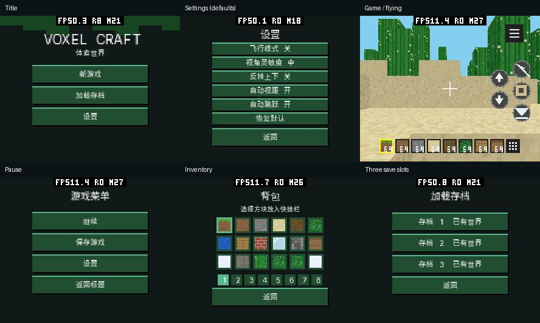
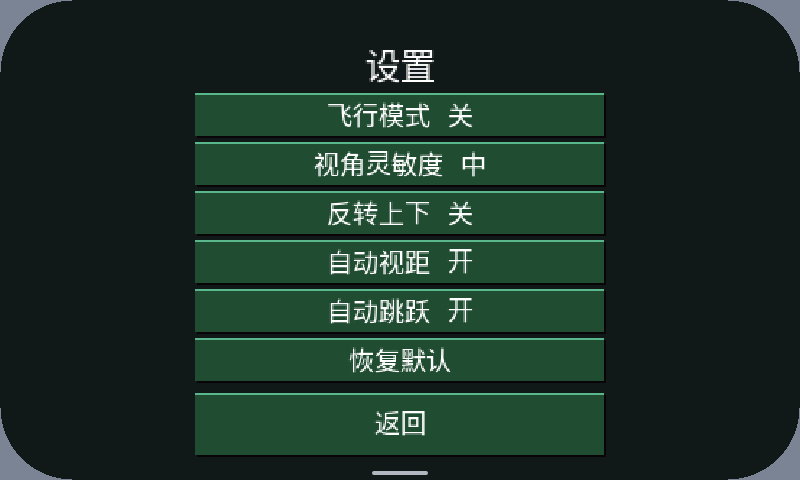
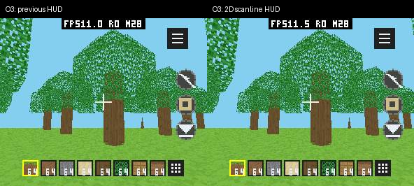
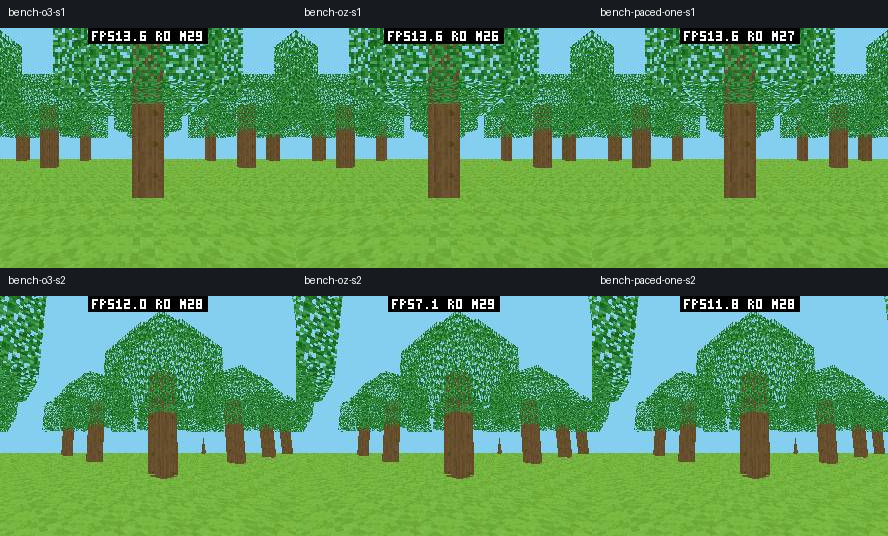

# Voxel Craft C++ 交互、字体与内存验收（2026-10-09）

本轮延续 [3D 与 SDK 优化验收](../performance/pxa-3d-20261009.zh-CN.md)，交付
Voxel Craft C++ 0.10.0，入口、几何和 SDK 统一使用 **O3**。不再为缩小代码
采用 Oz，也不以减小 AOT 文件为后续目标。原来的 C/C++ 等画质对照、深度扫描线内核、裁剪与树冠
修复继续有效；没有用新游戏随机地图的 FPS 替换旧报告的固定场景对照。
原始日志、前后包、截图及测试脚本保留在 workspace `local/voxel-ui-20261009/`。

HUD、字体和菜单直接画入游戏的同一张 Surface：世界之后追加 HUD 命令，一次
提交。Canvas 为 input-only，只接收触摸，不产生另一张全屏图层或合成缓冲。
打开菜单后暂停世界绘制，只在状态变化时重画页面。图标、按钮和字体仍有
编码、像素绘制或透明混合成本；系统覆盖层出现时 Host 保留合成回退。
HUD 差值使用相同 S2 只开关 HUD 的真机对照，见性能部分。

## 交互与画面

标题页提供新游戏、三个存档槽的加载及设置。右上角按钮打开游戏暂停菜单：
继续、保存、设置、返回标题。覆盖存档和放弃未保存进度分别确认。菜单期间
暂停模拟、挖掘与持续按住状态；返回前台不会带着后台残留输入继续走动。
左半屏拖动行走，右半屏拖动转向，摇杆不绘制。右侧依次是攻击/操作、放置、
跳跃；飞行开启后另有上、下按钮。底部八个快捷槽右侧打开背包。
工作台短按进入操作页，按住 0.38 秒开始挖掘，每 0.32 秒继续挖掘；长按也能
拆除工作台，取消触摸不会误触发短按操作。多指分别按 pointer_id 持有输入。

飞行和反转上下默认关闭，灵敏度默认中。自动跳跃默认开启并可关闭，仅在
落地行走碰到单格障碍且上方能容纳人物时触发；高墙、低顶和空中不触发。
设置单独持久化；载入存档恢复当时的飞行状态并同步当前菜单开关。
游戏中的飞行设置立即生效，新游戏使用当前设置。背包保留创造模式的 18 种材料选择，当前没有动物、保险箱、
生存物品数量或合成配方；工作台页是创造模式材料操作页。



字体明确使用 Sarasa Gothic SC / 更纱黑体 SC 的中国大陆字形。生成器指定
`Sarasa-Regular.ttc` 的 face 1，并断言字体族名，避免依赖集合的默认 face 0
（CL）或字体回退的地区选择。三个灰度覆盖图集为 10 / 14 / 18 像素，每档
112 个所需字形；通过 Host 逐 texel alpha 混合抗锯齿，没有运行时字体引擎。
小屏仍使用 10 像素 SC 黑体；Unifont 是备选，本轮没有加入或声称验证它。
SIL OFL 1.1 许可证随资源提供。

启动时根据分辨率、DPI、字体缩放和可用区域选一档字体；图集原始大小分别
12100 / 23716 / 39204 B，只加载一档。绘字每批最多八字，128 B 固定栈数组，
每字 16 B 编码。安全边距和四角半径参与控件绘制及命中；SDK 新增可选
`pxa/ui_display.hpp`，解析现有 UI 环境并将 Canvas 的 dp 指针坐标转换为 Surface
坐标，避免高 DPI 下按钮看得到却点不到。没有给其他应用增加默认缓存。

| 模拟器画面 | DPI | 字体 | 标题 / 设置 / 游戏 / 背包 / 点击 |
| --- | ---: | ---: | --- |
| 240×296，圆角 58，安全边距 10/8 | 240 | 10 | 通过 |
| 412×412，圆角 72，安全边距 10/8 | 320 | 14 | 通过 |
| 800×480，圆角 72，安全边距 16/12 | 480 | 18 | 通过 |



布局在环境事件后更新；运行期间改变 Renderer 尺寸、旋转后重新选择字体尚未
实现。128×128 只验证控件边界计算，没有完成所有菜单的截图验收。
没有降低树叶透明孔洞、共享深度、纹理或视距来抵消界面开销。

## 存档与 Host 完善

每份存档保存全部 98304 个方块、80 B 头、种子、相机、垂直速度、飞行状态和
快捷栏。每槽交替写 a/b 文件，按 1024 B 块异步写入并主动让出调度；关闭后
读回检查头、FNV 校验和、方块类型和文件末尾，成功后才原子发布有效版本索引。
加载先完整校验再替换世界，损坏文件不会污染当前世界。飞行到地形之外的
合法坐标允许保存，有限值和安全整数转换范围仍受限制。

暂停期间借用既有区块缓存的 96 KiB 空间暂存，结束后统一重建；没有额外世界
副本。三个槽各保留两版，磁盘上限 590304 B，加上少量设置及索引。pai-touch
私有文件逻辑配额从 64 KiB 改为 1 MiB，模拟器同步；配额不预分配 RAM 或磁盘。
修复 runtime 使用 `publisher:app`、包管理使用 `publisher~app` 的目录不一致：
只有新目录不存在时迁移旧目录，两边都有数据时保留旧目录而不覆盖。
认证后的卸载/清除数据同时处理这两个名字；测试应用的清理不会影响其他应用。

设备满盘更新曾触发 LittleFS 断言。保留了只读数据分区备份，未格式化或删除
用户数据；只清理本轮测试包及其临时上传。ESP installer 现在在创建 incoming
之前按解压后的文件大小、CTZ 开销、唯一目录和元数据估算空间，另留 128 KiB
提交/清理余量；不足返回 RESOURCE_LIMIT，保留当前包。压缩的 31 KiB 测试包
解压为 4 MiB，真机被正常拒绝，随后设备及原应用目录仍可读取。
O3 HUD 对照更新也触发一次正常空间拒绝：发现旧测试身份遗留五份存档，
通过同一开发签名恢复临时测试身份，clear-data 后卸载，并验证目录不存在。
只清理本轮 UI2 测试数据和失败的 inbox 上传；原应用与历史私有数据不动。

此检查是空间准入，不能当作写入过程的空间预留；其他并发大文件写入或 flash
故障仍可能使提交失败。LittleFS 2 的部分 ENOSPC 恢复问题见
[上游讨论](https://github.com/littlefs-project/littlefs/issues/1157)，本轮没有关闭断言、
修改其磁盘格式或声称实现通用损坏恢复。

## 原因、收益与内存

| 修改 | 原因与收益 | 内存变化 | 验证 |
| --- | --- | --- | --- |
| 可选显示指标解码与共用命中布局 | DPI 与 dp/Surface 坐标混用导致错点；圆角与安全区需保留操作空间 | 小值结构、固定数组，无默认缓存 | SDK 协议异常测试；三种分辨率实际点击 |
| 不绘制摇杆、暂停菜单按需提交 | 减少遮挡，菜单静止时停止世界投影和重复光栅化 | 不增加全屏 UI 临时缓冲 | 真机 20 页面/动作及前后台验证 |
| SC 黑体 A8 小批绘字 | 固定大陆字形、保持小字号抗锯齿，避免逐字四边形大命令 | 只驻留一档图集；八字栈批次 | 三档截图、页面原生光栅化 |
| 两版本存档与区块缓存暂存 | 保存中断不能覆盖有效版本；不能复制整张世界 | 热路径不分配；复用已有 98 KiB 缓存 | 三槽、覆盖/取消、重启、坏文件和高空坐标 |
| AOT 原文件提前释放 | 运行代码已复制到映射，重复持有原文件浪费 PSRAM | 正常 O3 包的源文件 574940 B 在实例化前释放；初始化数据正确复制 | 原文件释放时填 0xa5，20 次启动、部分加载失败、ASan/UBSan |
| 统一 O3 | 用户选择性能优先，移除入口 Oz 覆盖，不继续压缩应用代码 | 映射与真实峰值独立计量；不新增队列或大缓存 | 所有目标构建及 O3 真机对照 |
| HUD 改为 2D 扫描线 | 同一 Surface 的有序覆盖无需深度插值和访存；实际 LCD 11.001→11.529 FPS | 不增加任何缓冲、队列或 Guest 页 | 原生深度哨兵/采样对照、真机三轮、截图 |
| 绘制前背压 | 更快提交在树林斜视导致废弃和光栅化退化；只在有显示容量时构造 | 104 B 临时查询，无常驻队列/缓存；复用输入时间戳 | 最终 O3 两固定场景零废弃；与 O3 无背压吞吐差异小于轮间波动 |
| 安装空间检查 | 满盘更新后清理可能再次触发 LittleFS 错误 | 复用解析 workspace，无路径集合缓存 | 解压大小、共享目录、整数溢出测试及真机拒绝 |

WAMR loader 必须在解析初始数据之前设置 `wasm_binary_freeable`，原来在成功加载
之后才设置会使借用的内部指针被错误释放。修复这处所有权时序后，PXA 只对
动态读入、非 XIP、仅含六个标准 section 的 AOT 开启提前释放；Wasm、静态工作区
和 custom section 保持原策略。除清单类型之外还检查原文件实际魔数，Wasm 被错误
声明为 AOT 的回归也保持源文件；该测试和所有权测试均在 ASan/UBSan 下通过。没有修改 AOT ABI，也没有改变应用的两个导入。

内存是设备整机 heap capability 占用，不是将 Guest 和 Surface 重复相加。
`MEMORY START/STOP` 使用本次区间最低剩余内存：启动、首次资源加载、稳态、
保存、加载均纳入；截图编码放在独立验证，不混入此区间。
历史 boot minimum、budget peak 和 Surface peak_total 是另外的累计值，不能代替
本次峰值。原始字段、分次启动和测量方法保存在 [memory.json](voxel-craft-cpp-ui-20261009/memory.json)。

| 版本 / Host 策略 | SRAM 稳定 | SRAM 本次峰值 | PSRAM 稳定 | PSRAM 本次峰值 |
| --- | ---: | ---: | ---: | ---: |
| 0.9 原包 / 保留 AOT 源 | 272992 | 277256 | 3231560 | 3316044 |
| 新 UI / O3 / 保留 AOT 源 | 273028 | 277180 | 3689936 | 3980060 |
| 新 UI / O3 / 释放 AOT 源 | 272996 | 277260 | 3132164 | 3422608 |
| 新 UI / Oz / 释放 AOT 源（背压前） | 272992 | 277256 | 3012056 | 3297344 |

上表为中间诊断包，不能作为最终 O3 验收；其中 Oz 方案已弃用。
保存时带 2112 B PERF 记录器，峰值没有扣除。最终 O3 正常包和诊断包分别重测：
正常包从标题进入新游戏；诊断包加载三槽中的存档并再次保存。
稳态在 PERF 分配前读取，首次初始化、保存/加载与历史累计峰值分开记录。

| 最终包 / 测量范围（字节） | SRAM 稳态 | SRAM 本次峰值 | PSRAM 稳态 | PSRAM 本次峰值 |
| --- | ---: | ---: | ---: | ---: |
| 正常 O3，重启后的首次启动、新游戏 | 272992 | 277256 | 3130536 | 3173756 |
| UI2 O3 诊断包，随后启动、加载及保存 | 272992 | 277344 | 3131472 | 3422324 |
| 正常 O3，另一轮重启后连续 20 次启动/新游戏/停止 | 272900–272936 | 277252 | 3115452–3116496 | 3377556 |

首次正常启动相对原 0.9 冷启动，PSRAM 稳态低 101024 B、峰值低 142288 B，
SRAM 稳态及本次峰值相同。UI2 为第二次热启动，且包含调试代码与存档操作；
不能把其 3422324 B 峰值直接和旧版 3316044 B 冷启动比较，也不能替它扣掉
PERF 记录器。退出后 Host 保留部分共享界面缓存，第二次启动时它与装载临时
内存重叠，所以另补同一最终 Host 上的冷/热对照。

对照使用原 0.9 AOT（372508 B）和资源，只在末尾追加已通过 loader 回归的
12 B 空 custom section，令当前 Host 使用旧的源文件保留策略；所有原始执行
代码、初始数据和资源逐字节保留。它是装载策略代理，**不是未修改的历史包或
历史固件**。代理额外 12 B 也保留在实测值中，不作估算扣减。最终正常包不修改。
两者各重启后启动两次，不打开 JPEG/PERF；原包直接进入游戏，新包从标题进入
新游戏。代理的原始 AOT SHA-256 为
`fb43724d32e5ff9c311886d39687507e99bdc97d89a80df061cbe3a81463ebe2`，
保留前缀的校验、代理哈希和原始 MEMORY 字段见 `memory.json`。

| 同一 Host / 相同启动阶段（字节） | SRAM 稳态样本 | SRAM 本次峰值 | PSRAM 稳态 | PSRAM 本次峰值 |
| --- | ---: | ---: | ---: | ---: |
| 0.9 原执行代码，旧保留策略，冷启动 | 272912 | 277100 | 3245836 | 3327404 |
| 最终正常 O3，冷启动 | 272948 | 277176 | 3115480 | 3184344 |
| 0.9 原执行代码，旧保留策略，热启动 | 272912 | 277176 | 3245872 | 3544528 |
| 最终正常 O3，热启动 | 272912 | 277176 | 3115456 | 3401240 |

匹配热启动的 PSRAM 稳态低 130416 B、峰值低 143288 B；两次启动的整段 SRAM
最高值均为 277176 B，热启动稳态也相同。但首次单独阶段的新包 SRAM 峰值高
76 B、稳态样本高 36 B；两者 budget internal 都是 28956 B。不能声称每个阶段
SRAM 都逐字节不增长，也未将差异归因于尚未隔离的平台/观测开销。
MEMORY STOP 返回的瞬时当前值与之前稳态样本可不同，原始值全部保留。

20 次正常重启停止后的 PSRAM 为 1382988–1384048 B，最高值与最低值差 1060 B，
最后数次较高；frame / scratch / mailbox / probe 每次都回到零，无分配失败。
这支持游戏缓冲释放正确，尚未隔离约 1 KiB 的平台背景或缓存变化，不能作为
长时间完全无泄漏的保证。所有测试结束后恢复正常 0.10.0 O3 包，四个原应用保留。

| 单独核对的存储 | 原 0.9 | 最终正常包 | 备注 |
| --- | ---: | ---: | --- |
| Guest 线性内存 | 589824 | 589824 | 九页；最大声明仍为 32 页，未增加稳定页数 |
| World 对象 | 393984 | 393984 | 固定容量，含可复用暂存空间 |
| S3 AOT 文件 | 372508 | 574940 | Flash 文件增大，源文件载入后释放 |
| S3 text section 请求 | 342212 | 537080 | 与整个 AOT 文件大小分别记录 |
| S3 可执行映射 | 393216 | 589824 | 64 KiB 粒度；整体 PSRAM 已包含映射 |
| Host RGB565 帧缓冲 | 284160 | 284160 | 296×240，原两张 RGB565 缓冲 |
| Host 深度缓冲 | 142080 | 142080 | 原一张 Z16，保留透明孔洞与遮挡 |
| Host 命令队列 | 147456 | 147456 | 原三份 49152 B |
| 原始字体图集驻留 | 0 | 12100 | 此设备只加载 10 像素档，计入绑定纹理（raster） |

代码文件和磁盘存档增长属于新增功能的持久文件；最终 O3 的 RAM 以
新的本次区间记录为准，不沿用 Oz 的内存结论。没有通过增大帧/Z/命令缓冲换取速度，也没有增加默认 SDK 容器。

## 固定场景性能与验证

本轮对 -O3 / -Oz 使用相同代码、种子 0x5ae1、方块 FNV 667de4b0、相机、296×240、
24 格远面、完整透视纹理和透明叶孔。关 HUD、自适应和模拟，正式测量不带
VOXEL_PROFILE；每次预热 24 秒且至少 120 帧，8 秒采样、三次独立启动。
FPS 来自 LCD 去重完成间隔，另记录 Host 光栅化、队列和显示计数；截图在采样后。

单纯 -Oz 在 S1 维持约 13.7 FPS，在 S2 却只有 7.096 FPS：Guest 提交约 13.3 FPS，
Host 光栅化均值 124.566 ms、累计队列均值约 36–40 ms，120 个完成帧时最多已
废弃 105 帧；同时出现调度看门狗告警。不能把更高的提交速度作为收益。
尝试保留两个未退休列表后废弃降到零，但显示只有 9.512 FPS、光栅化约 92 ms，
仍有看门狗告警，因此没有采用。

背压在构造几何之前使用可选 `game_pacing.hpp` 查询退休数（rendered+dropped），
只允许一个尚未完成的列表。正在光栅化时跳过几何/编码，固定步长模拟和输入
继续；LCD 传输仍可与下一帧构造重叠。沿用 Host 有界队列和菜单即时提交，未加
缓存、任务或队列。复用旧输入时间戳记录被跳过的 tick，HUD 与自适应视距统计
使用实际接受绘制的时间间隔，删除已经不用的拖动字段，App 常驻结构不增。

中间 Oz 加背压的 S2 三次 11.890 / 11.852 / 11.925 FPS，均值 11.889；相同当前源码 -O3
三次 11.999 / 12.104 / 11.961，均值 12.021（约低 1.1%）。Host 光栅化
40.386→38.280 ms，累计队列均值回到约 2.4 ms，全部零废弃且没有看门狗告警。
中间 Oz 加背压的 S1 三次 13.685 / 13.681 / 13.596 FPS，均值 13.654，对照 O3 为 13.725
（约低 0.5%）。截图排除顶部 32 像素性能浮层后逐像素相同。

| 同 Host / 同场景 | LCD FPS 三轮均值 | Host 光栅化均值 | 累计队列均值范围 | ready→LCD 累计均值范围 | 废弃 / 告警 |
| --- | ---: | ---: | ---: | ---: | --- |
| S1 / O3，无背压 | 13.725 | 37.961 ms | 2.01–2.09 ms | 35.45–37.80 ms | 0 / 无 |
| S1 / Oz，无背压 | 13.696 | 37.732 ms | 2.06–2.10 ms | 35.51–37.84 ms | 0 / 无 |
| S1 / Oz，加背压（中间方案） | 13.654 | 37.469 ms | 2.05–2.10 ms | 35.84–37.25 ms | 0 / 无 |
| S2 / O3，无背压 | 12.021 | 40.386 ms | 2.24–2.34 ms | 32.85–36.81 ms | 0 / 无 |
| S2 / Oz，无背压 | 7.096 | 124.566 ms | 35.83–39.82 ms | 43.49–44.51 ms | 最多 105 / 有 |
| S2 / Oz，加背压（中间方案） | 11.889 | 38.280 ms | 2.36–2.42 ms | 36.63–37.63 ms | 0 / 无 |
| S1 / 最终 O3，加背压 | 13.659 | 37.628 ms | 1.99–2.01 ms | 36.34–37.72 ms | 0 / 无 |
| S2 / 最终 O3，加背压 | 11.975 | 38.047 ms | 2.23–2.37 ms | 36.10–37.07 ms | 0 / 无 |

最终 O3 三轮分别为 S1 13.731 / 13.689 / 13.557，S2 11.892 / 12.089 /
11.944 FPS；与较早 O3 无背压结果相差约 -0.5% / -0.4%，差值小于本次轮间波动，
没有证据表明 O3 下背压显著提高吞吐。采用它是为了限制未完成工作和废弃，
不能把中间 Oz 的恢复幅度算作最终 O3 的加速。最终两场景均零废弃、零看门狗告警；
裁掉顶部 32 像素浮层后，之前 O3 与最终 O3 的截图逐像素相同。
最终 Host 相对前一固件只增加装载文件实际类型检查，热渲染代码没有变化；
HUD 开关对照则都在同一最终固件执行。

HUD 单独对照（最终 Host、O3、同一 S2）增加固定场景宏 `VOXEL_BENCH_HUD=1`，
仅打开正常地面模式的按钮、八槽、数字、背包与准星，世界的工作负载不变。

| S2 / O3 | LCD FPS（三轮） | 平均 FPS | Host 光栅化均值 |
| --- | --- | ---: | ---: |
| HUD 关 | 11.892 / 12.089 / 11.944 | 11.975 | 38.047 ms |
| 原 HUD，深度纹理四边形 | 11.051 / 10.993 / 10.960 | 11.001 | 43.620 ms |
| 最终 HUD，2D 扫描线 | 11.523 / 11.551 / 11.513 | 11.529 | 39.427 ms |

HUD 的成本真实存在：旧路径较关闭 HUD 约低 8.1%；改用 2D 扫描线后恢复
约 4.8% 显示吞吐，剩余差值约 3.7%。光栅化额外成本从约 5.57 降到 1.38 ms。
三组均零废弃、零看门狗告警。没有把无 HUD 的性能当作正常游戏 FPS。
这只覆盖固定地面 HUD；飞行额外按钮、编辑、动作和其他场景的成本会不同。

原因是 HUD 图标原来使用世界的通用深度纹理三角形，承担了不需要的深度读写。
现改为 `.affine_uv=true, .painter=true, .lit_palette=false` 的现有 2D 扫描线，
按既有光照行 0 取色，保留透明 texel；在世界之后顺序覆盖，同一 DrawList 提交。
背包材料图标同样使用它。世界几何的共享 Z16、叶孔和裁剪没有改变；
帧、深度、命令队列与 Guest 页数不增加，没有为此压缩代码或降低 O3。
SDK 文档补充自绘 HUD 的可选用法，不增加默认模块状态。

原生哨兵测试证实 HUD 不改变既有深度值；合成透明渐变图案对照发现 20 个
像素在精确 texel 边界选择相邻样本，来自两个定点插值器的舍入差异，覆盖与
透明孔洞一致。测试限制差异量及相邻样本，不声称 HUD 逐像素完全相同。
实际游戏截图已经检查：按钮与物品坐标保持一致，世界没有画质变化。



队列和 ready→LCD 的范围来自每次启动预热至测量结束的累计 logger，包含预热，
不是 8 秒 PERF 窗口的独立计时。光栅化和完成间隔取 PERF 窗口原始样本，
FPS 是三次独立均值；原始包 SHA 和汇总见 [performance.json](voxel-craft-cpp-ui-20261009/performance.json)。



这些是同一 Host 上的编译/背压对照；不与前轮 C 的不同固件状态混成新语言结论。
Guest 更新、几何、编码、提交及显示各阶段的前轮诊断见 3D 报告，本次入口编译选择
不把这些旧阶段墙钟冒充本次重新测量的 CPU 时长。

减少同时访问外部内存的工作和过量构造是采用背压的原因；退化是否主要来自
PSRAM 总线竞争、缓存布局或线程调度尚未用硬件计数器拆分。已实测的是显示
完成、光栅化墙钟、废弃和告警的变化。新 UI 随机世界的 11.98 FPS 属于另一个
地图和相机，不能推断语言或编译收益。


验证日志：`final-all-native.log`（ASan/UBSan，输入/菜单/自动跳跃/存档头/坏数据/
世界/透明渲染/边界预算）、`sdk-final-display-tests.log`、`final-adapters.log`
（32/32）、`aot-type-tests.log`、`aot-type-asan-tests.log`、`host-services-final-integrated.log`、
`simulator-final-o3-tests.log`（13/13），新增背压的 `pacing-final-native-tests.log`
和 `pacing-sdk-tests.log`；`fast-hud-native-tests.log` 加入 HUD 不写世界深度及取样边界回归。
真机 `device-final-o3-functional/report.json` 20 场景通过，
`device-final-o3-restart/report.json` 恢复三槽和精确姿态，
最终正常包 `final-device-qa.json` 连续 20 次启动、新游戏和停止通过，
各次停止后 frame / scratch / mailbox / probe 都为零且无分配失败；
另验证标题、设置、游戏、暂停及确认返回标题的实际画面，不向正常身份写测试存档。
`device-interactions/report.json` 验证短按工作台、长按挖掘、放置与编辑重建，以及
Y=175.40625 飞行后保存/加载。O3 模拟器完整流程、重启恢复均通过（`sim-final-o3-qa.log`）。
模拟器损坏存档截断掉末尾 17 B 时拒绝加载，恢复原文件
后重试成功；三档 DPI 全部点击流程通过。测试中 5 秒以上的注入长按需要相同坐标
MOVE 心跳维持调试输入租约，不能把调试 watchdog 取消误判为物理触摸问题。

## 复现

```sh
SANITIZE=1 bash local/pxa-apps/voxel-craft-cpp/tests/test.sh
bash deps/pxa-system/tools/package/test_guest_cpp.sh
python deps/pxa-system/tools/wamr/test_source_pin.py
ctest --test-dir build/libpxa-adapter-tests --output-on-failure
ctest --test-dir build/simulator/pai-touch --output-on-failure
python local/pxa-apps/voxel-craft-cpp/tools/generate_menu_font.py
bash tools/app.sh build voxel-craft-cpp --source-root local/pxa-apps --target all
# 默认全部 O3。场景 2 将宏值改为 2。
PXA_APP_DEFINES=VOXEL_BENCH_SCENE=1 \
  bash tools/app.sh build voxel-craft-cpp --source-root local/pxa-apps \
  --target esp32s3 --aot-only --output /tmp/voxel-o3-s1
# HUD 对照：场景 2 另加 VOXEL_BENCH_HUD=1，其余配置保持相同。
# 通过实际 MAC 选择设备，避免 ttyACM 编号重排后刷到另一块板。
# 设备本轮重新枚举到 ACM1；当前 ACM2 是另一台设备。
python tools/pxadb/pxadb.py package install /tmp/voxel-o3-s1/pxa-voxel-craft-cpp.pxa \
  --port /dev/serial/by-id/usb-Espressif_USB_JTAG_serial_debug_unit_A4:CB:8F:D5:D4:F0-if00 --yes
python tools/measure-device-voxel.py \
  --port /dev/serial/by-id/usb-Espressif_USB_JTAG_serial_debug_unit_A4:CB:8F:D5:D4:F0-if00 \
  --app pxa-voxel-craft-cpp --package /tmp/voxel-o3-s1/pxa-voxel-craft-cpp.pxa \
  --output /tmp/voxel-o3-s1-measure --warmup 24 --seconds 8 --repeat 3 \
  --minimum-warm-frames 120 --local-heap --wake-home
```

应在测量前停止应用、唤醒并确保未锁屏；一次运行超过原设定的 15 分钟会自动锁屏，
该状态没有可见 Surface，不能当作性能样本。本轮只更新应用固件分区，保留四个
原应用和原私有数据，最终恢复正常 0.10.0 包；临时验证应用删除。亮度 10%、
10 分钟熄屏、15 分钟锁屏和原性能浮层未改变。S31 只有交叉编译，未做本轮实机验收。
突然断电下的 flash 原子性、动物/生存玩法、动态旋转和物理触屏到 LCD 延迟仍未验证。

## 交付定位

应用源码提交 `a23563d4167d926607215bbefd3cee17aea1a424`；PXA/SDK
`f3b1db8b6f17184b209b7225dc5061efffa792e4`；WAMR 所有权修复
`6a54186abc1c10c37c28e443107107c97af8f25f`。本地复用了 af07c787 版 wamrc，
与新 loader 的 `wamr-pxa-aot-v6-core-1` ABI 相同；本次改动不涉及 AOT 生成格式。
WASI SDK 34、C++26、Guest 和 AOT 编译均 O3、size level 0。
S3 / S31 / Linux x86_64 AOT 及 portable Wasm 均构建成功。

实际安装的正常 S3 容器 508471 B，SHA-256
`da20782123f0a8fe7e16671b972390a184776a198d9ed537d92e7dcbee38f59e`；
正常 AOT 574940 B。最终 Host 应用分区二进制 3329920 B，SHA-256
`82180b19f79c7078e8f87f52fe22a1951c7c8c652791d363e87786ad123607fa`，
刷写在 0x10000，未写 bootloader、分区表或数据分区。
精确包哈希、测试包及构建来源另见原始 `delivery-artifacts.json`、`delivery-source.json`。
Host 使用当前工作树构建，包含用户原有的音频、USB 和 UI 未提交改动；保留这些
内容，没有替用户提交。复现固件时须保留相同工作树，不能把源码提交当作全净
checkout 的二进制保证。应用源与测试、SDK、Host 适配和报告分别提交；未推送。
