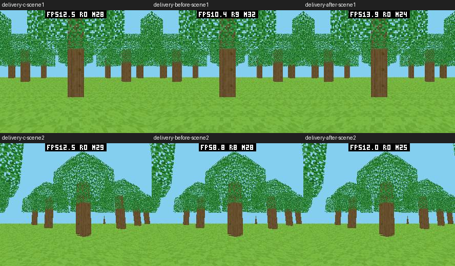
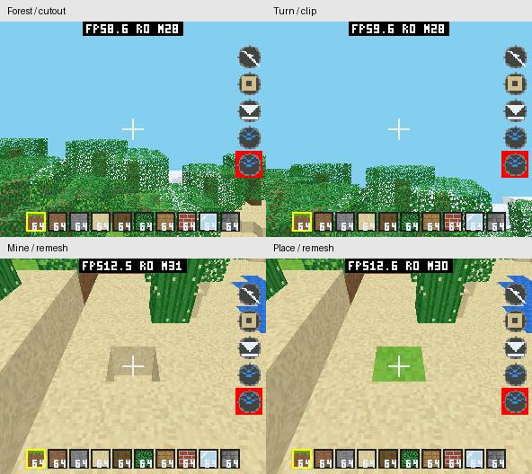
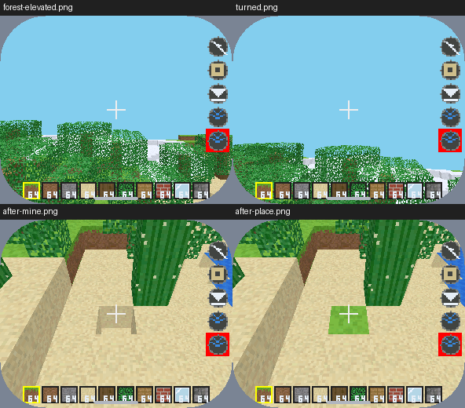
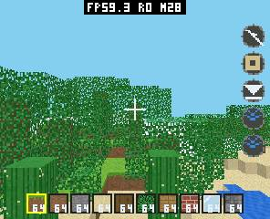

# PXA 3D、游戏与 C++ SDK 优化验收（2026-10-09）

本轮使用 pai-touch /dev/ttyACM2（ESP32-S3）。只更新应用固件分区和两个 Voxel 包，保留原有 Pixel Dungeon、Store、应用数据以及用户未提交改动。全部原始报告、包、串口日志与实验在 `local/pxa-3d-goal-20261009/`；上一轮接口审计在 `local/host-interface-20261008/REPORT.zh-CN.md`。

## 对照条件与计量

两版共用 `local/pxa-apps/common/voxel_benchmark.h`：64×24×64 方块字段，98304 字节逐项一致、FNV-1a 667de4b0；种子 0x5ae1，49 棵木干优先生成的树。296×240 RGB565，FOV 1.221451928，near=.25、far=24（视空间 Z）。场景 1：eye=(32.5,9.6,18.5)，yaw=0、pitch=0；场景 2：eye=(18.5,9.6,18.5)，yaw=.7、pitch=-.15。原生另对照 45 张已解码材质（11520 个 texel）的 RGB565 与透明标记及中性 256 色调色板，全部一致（texture-equivalence.json）。两版关闭应用 HUD、LOD、自适应视距及模拟，保留完整透视纹理、树叶 index0 孔洞、共享 Z；光照统一调色板第 0 行。原有板级性能浮层保持开启；顶部 FPS 文字随实测变化，画面对比排除这块覆盖区域。

C 使用 16 格区块，C++ 使用 8 格区块，命令数和合并面不同；这是相同方块世界的最终渲染实现对比，不是只替换语言的编译器实验。历史生产地图、错 UV 或径向剔除的实验均不作为等画质语言对比。旧 C++ 基线使用 apps 665ba79d 与 SDK game3d 的原始实现，补入相同 fixture、相机/UV/光照和视空间远面修正；保留旧 384 面缓存、通用裁剪三角形绘制与重复顶点处理。冻结快照及签名包保存在 `baseline-src/`、`cpp-baseline-frustum{1,2}-artifacts/`。

每轮预热 24 秒且至少已完成 120 帧，然后采样 8 秒、独立运行三次。PERF 的显示间隔由 LCD 传输完成、去重 PXA FrameId 得到；不使用应用提交 FPS。所有计数器无溢出且截图来源为 surface、frame_id 非零。每次启动前检查应用停止且 frame/scratch/mailbox/probe 全为零。解锁、共享音频/显示预热在采样前单独执行，不在窗口内引入自动前台应用。

Guest 阶段诊断使用 VOXEL_PROFILE，复用原命令存储准备几何，边界计时再编码，不逐面采样。冻结模拟的 update_us=0 表示工作负载没有模拟，不表示真实游戏更新免费。生产诊断另记录更新。提交墙钟时间包括 Host 抢占/等待，不能加到 Host 光栅化时间上当作串行 CPU 总耗时。queue_wait_us 是累计排队时间；present_us 是 raster-ready 到 LCD 完成，1 ms 分辨率，必须取窗口差值再除完成数。Surface visible_frames 是显示取得帧计数，实际显示 FPS 使用 LCD 去重间隔。

| 场景/实现 | 三轮 LCD 完成 FPS | 均值 FPS | Host 光栅化均值 |
| --- | --- | --- | --- |
| S1 / c | 12.584 / 12.585 / 12.590 | 12.587 | 49.673 ms |
| S1 / before | 10.448 / 10.449 / 10.421 | 10.439 | 40.983 ms |
| S1 / after | 13.889 / 13.886 / 13.928 | 13.901 | 37.061 ms |
| S2 / c | 12.563 / 12.538 / 12.476 | 12.526 | 47.933 ms |
| S2 / before | 8.911 / 8.919 / 8.911 | 8.914 | 46.792 ms |
| S2 / after | 12.050 / 12.119 / 12.153 | 12.107 | 40.223 ms |

S1 C++ 较旧 C++ 提高 33.16%，较 C 高 10.44%。Host 光栅化 40.98→37.06 ms。

S2 C++ 较旧 C++ 提高 35.83%，较 C 低 3.34%。Host 光栅化 46.79→40.22 ms。

同画面对比：左 C、中修正远面后的旧 C++、右最终 C++。树干、树冠与叶孔均保留；顶部为用户原有性能浮层。



阶段诊断（S2，预热后日志窗口差分，单位 ms）：旧版 54 帧、最终 78 帧。
几何/编码计时仅五个阶段边界，共用原 49152 B 存储；旧版诊断 encoder
输出与原版 245 个可见面、237 批、14848 B wire 逐字节一致，ASan/UBSan 通过。

| 阶段 | 旧 C++ 诊断 | 最终 C++ 诊断 |
| --- | ---: | ---: |
| Guest update（冻结场景） | 0 | 0 |
| 几何/可见面/投影/裁剪准备 | 57.544 | 28.787 |
| 命令编码 | 6.415 | 5.519 |
| HUD/收尾（应用 HUD 关闭） | 0.279 | 0.109 |
| 提交墙钟，包含等待及 Host 抢占 | 48.249 | 41.546 |
| Guest 绘制总墙钟 | 112.586 | 76.064 |
| Host 光栅化（完整采样窗口） | 46.526 | 39.563 |
| 命令排队，每完成 render | 1.991 | 2.302 |
| raster-ready→LCD 完成，每 visible | 38.074 | 36.679 |
| 丢弃帧 / 完成帧（日志差分） | 0 / 54 | 0 / 78 |

计时改变代码布局/调度，旧诊断 FPS 8.234（旧正式固定包 8.914），新诊断
12.517（正式固定包 12.107）。因此上表是诊断工作负载的阶段归因，**不能把它当成
无测量成本的 CPU 分解或用诊断 FPS 宣称额外收益**。阶段等待可重叠；正式收益
以之前三轮无 VOXEL_PROFILE 的结果为准。更快的 Guest 并未消除约 2 ms 排队，
显示流水线仍有约 37 ms ready 延迟，但此场景没有靠废弃帧抬高提交帧率。

C 的既有异步 Clock 采样在 S2 三窗口共 9 个样本，中位数 update bookkeeping
0.174、project 16.461、sort 1.020、build 2.986、submit 48.611 ms；project
范围 15.030–90.085 ms、submit 34.014–77.253 ms。Clock 请求响应包含调度，
无法用这些稀疏墙钟样本作 C/C++ 精确 CPU 比值；原始范围保存在
`delivery-c-stage-summary.json`。C Host 光栅化和 LCD 均为直接完成计数器，
正式 FPS 对照有效。正常世界的 C++ 交互诊断另外记录 update 均值 46 µs
（97 个绘制统计样本时的最新累计值），场景在移动/编辑，不能与固定场景混算。


## 原因、收益、内存与验证

| 优化 | 原因及性能/体验收益 | 存储变化 | 验证与取舍 |
| --- | --- | --- | --- |
| 保留 pxa_submit/pxa_io，批量 wire IO | 两个导入本身不是已测瓶颈；同步校验后借用 Guest payload、复用组件索引 | 上轮每引擎减少 4072 B；异步命令仍复制到有界邮箱 | 等效 128 矩形、3112 B、一次 IO：设备 C/C++ 30.653/30.609 FPS；原生 C++ 多约 0.14 µs，显示上限掩盖差异，不能说分发没有成本 |
| 深度扫描线材料分类 | 纯色不插值 UV；恒定光照索引纹理减少无效插值；AFFINE_UV 与逆深度独立 | 利用 scanline 结构填充；帧/Z/队列不增加 | 纯色、仿射、透视、透明孔洞、双提交顺序和 32 组跨内核对照通过；保持开放世界共享深度 |
| 裁剪面使用深度四边形扇形 | 旧四边形 scanline、裁剪三角形却用通用 barycentric；统一为低成本 scanline | 三角形 48→56 B payload，但固定 49152 B 队列槽不变；先预检整个面容量 | SDK 凸 3–10 周界、零面积扇面跳过、预算不足无半面；Host 校验/像素/Z 对照；默认四顶点走直接编码避免额外 64 位运算 |
| 相机/几何准备 | 一帧四次 sin/cos；先背面/视锥剔除再 UV、角点用基向量增量；一次顶点倒数与有界 IEEE rounding | 相机可选 48 B，删除重复 worldVertices 临时数组；无全场景 transformed cache | 六法线、非等长矩形 UV、半整数两侧及随机 rounding、1024 定点属性裁剪一致；相机类型按需包含 |
| 按实际顶点构造裁剪存储 | 两个带默认成员初值的数组每次写 20 顶点，往往只用少数 | 两块既有栈存储仍为 480 B；placement copy 无堆分配 | 8192 组六平面裁剪坐标/UV/光照/深度逐字段一致、ASan/UBSan；真机单项实验 S2 11.056→12.095 FPS；最终包另测 |
| 8 格、192 面区块缓存 | 384 容量冗余；较大区块增加投影跨度和过绘 | World 688896→393984 B（-294912）；Guest 页数降低 | 32 种子、3062 棵树、自然最大 173；128 容量 141 次溢出淘汰；超容量分页复用、六边界及编辑覆盖独立邻接对照 |
| 视空间远面修正 | 径向距离额外剔除视锥边缘仍可见的树干/树冠 | 无缓存增加 | (40,8,32) 远角块旧径向剔除却应可见；native 和与 C 截图交叉验证；超过远面仍不绘制 |
| 资源/粒子/HUD | 45 材质初始化 load-bind-close；闲置粒子提早返回；HUD 布局只按实际尺寸重算 | 同一 64 槽粒子固定池，游标取代既有游标，无默认大容器 | 资源引用由 Renderer 持有；idle 40 B command、零 new；live 白色粒子/Z 与页面寿命 ASan；正式帧不解码文件 |
| 模拟/输入 | 约 10 FPS 时旧最多四步丢失模拟时间；改显式八步；yaw 控制地面运动，保留摇杆幅度 | LoopOptions 常量，无新默认字段；对象池/统计为可选显式容量 | 16 ms×8、慢帧有界、暂停重置、模拟器/设备移动转向；多指取消、墙/挖掘碰撞和半幅/对角线 native |
| AOT/Wasm 打包 | Release DWARF 无运行价值，保留 Debug 选项和 Wasm name 段 | 17 Component Wasm 合计 4224894→1219455 B；代码/数据与原生 AOT 逐字节不变 | 不把压缩包加载改善当 FPS 收益；独立 SDK 15 示例、三目标消费及核心段一致 |
| 安装器让出 CPU | 大包连续 SHA/写入垄断任务，曾触发任务看门狗 | 无新任务、缓冲/状态；每 4 KB 工作后让出 1 tick | 实机大包反复安装没有 watchdog reset；UART 音频 FIFO/ADC 告警仍有记录，未宣称解决声学质量 |
| 真正显示完成与运行峰值 | 旧直接扫描 FPS 浮层仍依赖旋转帧计数；历史 heap minimum 混合多应用 | Frame 目标 208 B/native 224 B 不变，板级利用 6 B padding；MEMORY 监测按需 | LCD 完成去重+ready 时间；MEMORY START/STOP allocation minima 恢复历史统计；诊断 probe 2112 B 单列 |

可选 MaterialPolicy 保留 RGB565 微小不透明面、约半纹素 UV 误差的仿射路径，cutout 始终采样。默认游戏关闭该近似：树林斜视实测未获益；正式包和最终对照均使用完整透视纹理，没有靠缩视距/分辨率、取消深度或消除树叶孔洞提高 FPS。

淘汰实测方案：16 格/640 面缓存更省内存但变慢；固定 UV/light 顶点虽由 24→20 B，S1 12.59→11.48 FPS，不默认启用；noinline 专用深度 span 函数在设备退化，恢复标量专用内核；逐面时钟明显扰动帧率。没有在缺乏设备收益时引入 SIMD、SRAM 行缓存、额外并行任务或更大的帧队列。micropixel 的无 Z 多边形排序不适用于可编辑开放世界。

## 内存口径

整机 SRAM/PSRAM 记录稳定占用及本次启动/稳态窗口真实峰值；初始化与预热单列。heap_min、Surface peak_total、budget peak 是开机以来的历史量，报告不拿它们冒充本次峰值。MEMORY START 使用 ESP-IDF 分配事件最小值而非采样轮询；STOP 还原历史 minima。冷启动包含共享音频的 16392 B 延迟缓存，最终 C/C++ 均先预热，完整窗口原值留在 report.json。

Host C++ frame=284160 B（两张），C frame=426240 B（三张）；depth=142080 B、mailbox=147456 B（三个 49152 槽）；诊断 probe=2112 B，结束后为零。缓冲策略两版本内部前后不变，不能把 C 的第三张帧差值称为语言内存开销。板级显示输出仍为两张。生产 C++ 线性内存 min 13→9 页，即 851968→589824 B；max=32 页固定。堆修复后的旧生产代码映射为 393216 B；最终生产映射仍为 393216 B（请求 342212 B），没有用 canonical 的 327680 B 偷换生产值。

| 项目（字节，整机） | 旧 C++ | 最终 C++ | 结论 |
| --- | ---: | ---: | --- |
| 固定场景稳定 SRAM / 采样峰值 | 286176 / 286264 | 286176 / 286264 | 不变 |
| 固定两场景本次启动 SRAM 最坏峰值 | 294604 | 294476 | -128 |
| S2 启动 SRAM 峰值，单独列出 | 294468 | 294476 | 本次样本 +8；两场景整体最大未增长 |
| 固定场景稳定 PSRAM（最大） | 3382852 | 3129100 | -253752 |
| 固定场景稳态 PSRAM 峰值（最大，含探针） | 3383456 | 3129704 | -253752 |
| 固定场景本次启动 PSRAM 峰值（最大） | 3683600 | 3430580 | -253020 |
| 生产包稳定 SRAM / 稳态峰值 | 286176 / 286264 | 286176 / 286264 | 不变 |
| 生产包本次启动 SRAM 最坏峰值 | 294468（3 次） | 294468（20 次） | 不变 |
| 生产包稳定 PSRAM（最大，含探针） | 3481704 | 3227676 | -254028 |
| 生产包稳态 PSRAM 峰值（最大） | 3482120 | 3228260 | -253860 |
| 生产包本次启动 PSRAM 峰值（最大） | 3782328 | 3528556 | -253772 |
| Guest 已提交线性内存 / 本实例峰值 | 851968 / 851968 | 589824 / 589824 | -262144 |
| 生产 AOT 文件 / 对齐代码映射 | 330412 / 393216 | 342212 / 393216 | 文件 +11800，映射不变 |

SRAM 单场景的 8 B 差值如实保留，未声称每一次初始化采样都更低；正式包
20 次的最坏启动值与旧正式包相同。整体对照的稳定占用和实际峰值均未增长。
20 次停止后 frame/depth/mailbox/probe 均归零；SRAM free 恒为 26555，PSRAM free
在 6977572–6977696 B 之间波动，没有随重启持续下降（原始逐次值保留）。WAMR
每次 linear_peak=589824，销毁后 linear=0；生产代码映射始终为 393216。
生产地图与固定 fixture 不同，此处只验收生命周期和内存，1 秒短窗口的约 9 FPS
不用于 C/C++ 语言对照。

Guest linear_peak 是本次 WAMR 实例实际已提交线性内存峰值，反复启动重建实例；它包括保留的辅助栈区域，不能提供实际辅助栈使用高水位。当前未给辅助栈添加默认扫描器或缓存，实际栈高水位仍是限制。

## 正确性、验证与交付

树木先地形后植被，完整 45 材质、仙人掌绿色；叶片透明 texel 不写颜色或深度，clip 插值保留 UV/Z。C 的 Z 面及水平 V 方位错误也修正，避免用有错误纹理的 C 当作画质基线。原生检查全部区块邻接展开、编辑后重建和 overflow 分页；远角漏面有专门回归。

本轮核心 libpxa 83 项、产品模拟器 Host 13 项、ESP Surface/Host ASan/UBSan、C++ 29 组套件及 IPC/容量、两版 Voxel 原生 ASan/UBSan、PXADB/开发工具和 CMake release/debug 的相关回归见原始日志。SDK 15 示例三目标仓库内和 45 次仓库外构建、17 Component 三目标 Wasm 逐项一致；最后裁剪 header 更改仅影响 game 示例，追加其仓库内/外三目标重建后再次全量哈希审计。模拟器使用独立实例 `pai-touch@pxa-3d-goal`，不碰默认实例数据；模拟器 FPS 不作为 ESP 数据。

micropixel 原目录 c2bc418e 的本地改动保留；fetch 后在独立 detached checkout 检查 4e821388445c3227d7d4d1007e51a10c76b953c4（`local/micropixel-reference-20261009`）。参考其 scanline、恒定材质、定点插值、背压和分块设计，以 PXA 既有 Z-buffer/能力协议实现；未复制其 Apache 代码或无深度排序。检查范围包含游戏循环、输入、碰撞、资源生命周期、音频调度、显示、缓存和 AOT；按实测瓶颈选择落地工作。

设备正常世界诊断包覆盖固定视角、飞行升降、摇杆移动、转向和近面裁剪：
挖掘 (32,8,36) 的 sand 后 edit_count 0→1；同格放 grass 后 1→2，
目标块类型和命令数据随重建变化。HOME 后连续 4 秒 PERF 的 raster/present 都为 0，
恢复时位置、编辑状态保持且 FrameId 继续推进。设备截图可见树叶孔洞、树冠、
挖空的格子与放置后的绿色方块。独立产品模拟器也完成移动、转向、挖放和截图检查。





512 B 地形预算诊断运行两次均通过：记录 budget=512/exhausted=1，地形提交停在
整面边界，HUD 仍使用剩余命令空间（整帧约 3056 B）。native 测试另检验面预算
不足时不提交半个 polygon。512 B 截断图不是正常画质，不拿其约 28 FPS 宣称提速。
正式包反复启动 20 次、每次停机排空并重新启动全部成功，没有动态线性内存累积。

调试注入最初的瞬时 TAP/drag 失败，原因是 INPUT SYNC 只确认注入队列处理，
LVGL 的定时读取可能看不到同轮 DOWN/MOVE/UP 的短暂状态；测试修为按住 0.2–0.55 秒
并等待读取后，设备/模拟器均通过。该现象不是物理触摸延迟的测量；本轮没有
宣称改善或量化触屏到 LCD 的完整延迟。

921239 B 的多目标诊断包在这台设备一次安装失败（INTERNAL/-11，具体原因未证明）；
相同执行代码的 S3 AOT 专用诊断包安装和验证成功，最终使用 S3 AOT 专用生产包（C++ 310364 B、C 另保留原身份），
不删除原有应用/数据。完整多目标包保留供模拟器与交叉构建，未把这次失败隐藏为通过。
临时探针和输入取消，测量结束停止 allocation minimum 监测；本轮没有修改设备设置。
保留之前恢复的 10 分钟熄屏、15 分钟锁屏、10% 亮度与原有板级性能浮层。


## 复现

```sh
SANITIZE=1 bash local/pxa-apps/voxel-craft-cpp/tests/test.sh
bash deps/pxa-system/tools/package/test_guest_cpp.sh
ctest --test-dir deps/pxa-system/build --output-on-failure
ctest --test-dir build/simulator/pai-touch --output-on-failure
# 构建固定场景，两个语言必须同时使用 scene 1 或 scene 2。
PXA_APP_DEFINES=VOXEL_BENCH_SCENE=2 bash tools/app.sh build voxel-craft-cpp \
  --source-root local/pxa-apps --target esp32s3 --output /tmp/voxel-cpp-scene2
PXA_APP_DEFINES=VOXEL_BENCH_SCENE=2,VOXEL_AUTOPLAY=1 bash tools/app.sh build voxel-craft \
  --source-root local/pxa-apps --target esp32s3 --output /tmp/voxel-c-scene2
# 分别安装；每次停止前一个包，先在窗口外 HOME/解锁并预热共享状态。
python3 tools/pxadb/pxadb.py package install /tmp/voxel-cpp-scene2/pxa-voxel-craft-cpp.pxa --port /dev/ttyACM2 --yes
python3 tools/measure-device-voxel.py --port /dev/ttyACM2 --app pxa-voxel-craft-cpp \
  --package /tmp/voxel-cpp-scene2/pxa-voxel-craft-cpp.pxa --output /tmp/voxel-cpp-measure \
  --warmup 24 --seconds 8 --repeat 3 --minimum-warm-frames 120 --local-heap --wake-home
# 阶段诊断另构建 VOXEL_PROFILE=1；普通最终 FPS 包不带它。
```

SDK 开发包包含 C++ 实现/头、CMake、协议、工具/生成器、15 示例、锁定配置和 wamrc；WASI SDK 从外部提供。清单与归档 SHA256、原始构建和测试日志随交付保留，无签名私钥/缓存/Git 信息，未对外发布。

仍未验证的完整 SDK 发布条件：本轮 S31 实机、所有系统弹层与直接扫描组合、实际 Guest 辅助栈高水位、各 UI/协程/标准库模板的独立成本、实际网络和音频声学质量/突然断电。交叉构建或旧设备记录不替代这些证据；本轮游戏优化与开发包交付不将整个 M6 正式发布标为完成。优化后的 C++ 仍可能在其他地图和相机有不同瓶颈，两处固定场景不保证全世界所有负载领先。


## 代码与证据定位

本轮 scoped 本地提交：Host/SDK `deps/pxa-system` 055d256，游戏仓库
`local/pxa-apps` 98c5f1c。根仓库记录显示/峰值诊断和本报告。构建时还包含用户原有
未提交音频/UI/USB 等改动，不将这些改动混入本轮提交；原始工作树补丁保存在
`{root,system,apps}-start.patch`，最终交付另保存剩余补丁和产物 SHA 清单。
micropixel 原目录不改动，参考检出独立保留。

原始对照入口：`delivery-comparison-summary.json`，6 组 `delivery-{c,before,after}-scene{1,2}/report.json`
和 serial.jsonl；阶段诊断 `delivery-{before-stages,stages}-scene2/`；正常世界交互
`delivery-functional-real-device/`、`simulator-delivery-check/`；预算边界
`delivery-budget512-device/`；旧生产包内存 `delivery-before-production-device/`、最终
20 次 `delivery-repeat20-device/`。构建脚本 `build-delivery.py`、测量脚本
`run-delivery-comparisons.py`、注入脚本 `device-functional.py` 与原始冻结基线源码保留在同一目录。


最终设备验收 `delivery-final-device/report.json` passed=true：安装 C release_sequence=6、
C++ release_sequence=10 的正常包，四个原 publisher/app 身份不变。C++ 正在前台，
最终 surface 截图 FrameId=32；probe=0，frame=284160、depth=142080、mailbox=147456，
资源 budget denied/allocation_failures=0。独立模拟器进程正常停止，测试实例数据保留。




开发 SDK 归档：`local/pxa-3d-goal-20261009/pxa-cpp-sdk-1.0.0-dev-20261009.tar.gz`
（24287034 B），SHA256 `47db4a80583408a1d40f6f6c559cb1dc4eff927fb33f4ccd61df0898e7ed1eb8`。
`SOURCE-SHA256.txt` 核对 197 个交付文件；189 个 SDK/工具/协议/配置源文件与
当前测试工作树一致，没有私钥、签名目录、Git 或构建缓存。Linux wamrc 和
PXA/WAMR 许可一并提供。固定旧版源码归档 `voxel-baseline-source-20261009.tar.gz`
保留两套基线（不包含签名键）；`DELIVERY-SHA256.txt` 包含测试包、正式包和
已刷写应用固件 `pxa_esp_platform.bin` 的摘要。完整日志留在本机，未上传或发布。

测量汇总另存 `docs/performance/pxa-3d-20261009/measurements.json`，保留三次 FPS、
逐次启动峰值和诊断窗口差分；它不替代原始 report.json/serial.jsonl。
