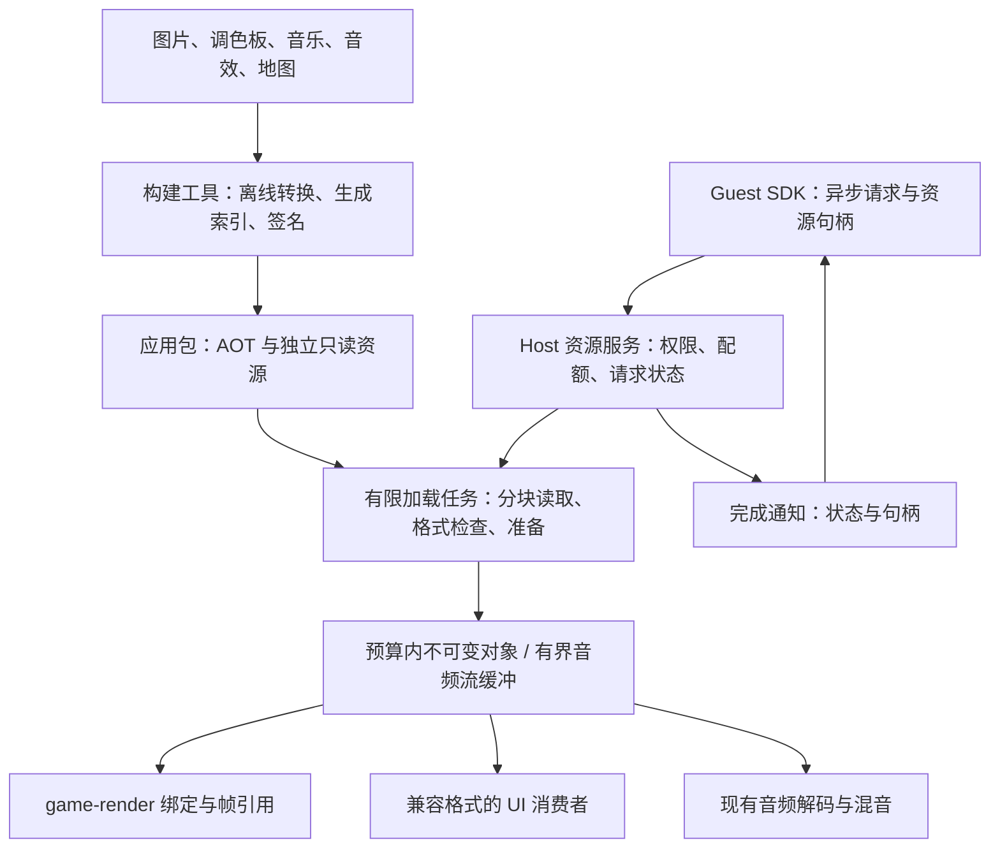

# PXA 资源架构设计

> 用户最新修订：完整性校验仅在安装时执行；运行时信任已安装包，不检测安装后的修改。移除重复资源 SHA、块摘要表及专用校验缓冲。下文历史分块认证设计由此修订覆盖，路径/格式/长度/预算与生命周期检查继续保留。

本文规定下一步重构方向，不是已实现 API 手册。完整完成标准以 [目标描述](pxa-resource-refactor-goal.zh-CN.md) 为准。

核心决定：大型资源离开 AOT；Host 管理有预算的不可变对象；Guest 用句柄表达使用关系；绘制只消费已经准备好的资源。文件加载节省的是重复副本和非当前场景资源的驻留量，不会让当前帧必需的纹理完全不占 RAM，也不保证光栅器自动变快。

## 1. 数据流与模块边界



| 层 | 职责 | 约束 |
| --- | --- | --- |
| 包工具 | 转换、索引、签名清单、声明限制 | 原始图片不必随编译后纹理重复打包 |
| 资源服务 | Guest ABI、身份与权限、请求终态、句柄 | 不在服务调用中同步读取大资源 |
| 预算与缓存 | 全局和应用记账、预留、去重、淘汰 | 不承担渲染，不持锁做 I/O 或释放堆内存 |
| 加载器与平台适配 | 文件读取、格式检查、分块取消、最终对象分配 | POSIX / ESP 共用格式与状态语义 |
| 渲染、UI、音频 | 消费已准备对象或流缓冲 | 实时路径不冷加载、不等待长时间锁 |
| SDK | 类型明确的操作、解析、场景资源释放 | 薄封装，不另建资源系统 |

现有 `asset_catalog`、`asset_loader`、`asset_cache`、`raster_assets` 已接入 desktop / ESP Host 的文件纹理路径；Guest Assets 服务、场景 SDK 与 GameRender 批量绑定已实现。ESP 复用一个永久资源任务，已完成主机模拟和两个板子的构建；真实签名 AOT 已在 desktop 运行。文件纹理、动态上传及部分 UI/音频分配已接入共享预算，实际 UI 解码、desktop codec 私有分配和其他平台开销仍需接入或完整汇总，后续完整集成验收尚未完成，具体证据见执行记录。

## 2. 文件格式与存储策略

- 纹理优先离线转换为当前渲染器可直接读取的 INDEX8，配套 RGB565 调色板。Host 分块读入最终像素对象，避免“整文件缓冲 → 解码缓冲 → Guest → Host”的多次复制。
- 索引记录资源类型、编码、版本、尺寸、存储长度、展开长度和清单关联。保留单资源随机读取能力，先不增加全包压缩或通用容器嵌套。
- UI 图片优先在打包阶段从 PNG 转为 PXR1 IMAGE：不透明图片可显式选择 RGB565，默认 BGRA8888 保留完整颜色和直通 alpha。运行时由同一资源 worker 直接读入最终 IMAGE 对象，像素只计费一次；UI 节点引用它。离线展开会增大包内文件，原 PNG 可放在应用的 resources/ 源目录，避免一起打包。Canvas 也支持准备好的 IMAGE 句柄；旧路径接口的应用迁移仍需完成。
- 这不是对每个小图都自动省内存的规则。Weather 的 64×64 半透明图在同画面实测，BGRA 常驻使共享外部峰值由 41531 B 增至 127086 B，Guest 线性高水位也增加 4096 B；完整数值与限制见执行记录。低色数图片可以考虑有界索引或按可见区域驻留，但必须解决 LVGL 缩放绘制并通过逐字节画面、原生内存和 CPU 验收后才启用。PXR IMAGE 现支持 RGB565、直通 alpha BGRA8888 和预乘 alpha BGRA8888；失败的索引实验没有进入 ABI。
- 短音效预加载，长音乐继续流式解码。地图等 Guest 数据提供带最大请求长度的异步分块读取；Host 先完成读取，运行时再将结果复制到经重新检查的 Guest 缓冲。worker 不保存可能失效的 Guest 原生指针。
- 小常量、很小的合成音和廉价的程序纹理可以留在代码中。voxel-craft 要比较离线文件、生成代码和生成后缓存，不能仅为展示文件加载而增加存储及启动开销。
- 不以修改 WAMR 加载方式为前提。AOT 加载器还需要的内存必须保留；资源外置也不能让已经增长的 Wasm 线性内存自动缩小。

安装/更新阶段完成 manifest 签名及文件 SHA 校验；启动和资源读取直接信任安装结果，不重复扫描文件，也不检测安装后的修改。运行时保留格式、长度、路径归属、内存和生命周期检查。

当前编译器生成 PXRI 1.3，不附加 blob 或音乐块摘要表。读取器可跳过旧 1.1/1.2 的摘要字段，但不计算或比较流内容摘要。音乐直接读入解码器输入区，没有独立 4096 B 校验缓冲。PXR1 仍为 1.0；Assets 2.0 取消旧 READ 校验块边界限制，旧 Guest 需使用当前 SDK 重新编译并打包。Assets 2.1 增加 IMAGE 的 LOAD/PREFETCH；UI 0.5 增加 IMAGE_HANDLE 属性，UI 0.6 增加 Canvas IMAGE_HANDLE 指令。PXR1 的 IMAGE kind=4，encoding=2 表示 RGB565，encoding=7 表示直通 alpha BGRA8888，encoding=8 表示预乘 alpha BGRA8888；像素长度精确等于宽×高×像素字节数，最大尺寸 4096×4096，分配仍受实际缓存/全局预算限制。预乘格式的每个颜色通道不得大于 alpha，资源编译时验证；Host 直接加载最终像素，LVGL 按对应 alpha 模式解释。PNG 的索引元数据可查询，PNG 本身不作为 IMAGE LOAD 格式。UI 的旧路径退役、真实应用迁移和完整元数据预算等其他目标继续保留。

Canvas 的准备阶段每次重新验证唯一句柄，绘制阶段使用已解析的描述符。句柄序列不变时复用整组绑定，位置、透明度和裁剪仍来自新帧；序列变化时使用备用绑定数组，提交成功后才转移旧描述符的所有权。不再使用的包装先释放像素引用和解码缓存，再进入空包装池；无图片帧或节点销毁时释放这些元数据。失败时恢复池中借用的包装，不破坏旧帧。这样可减少稳定提交路径的分配，但 alpha 合成快照、LVGL 自身绘制分配和完整元数据预算仍需分别测量与处理，不能将此称为整个 UI 零分配。

### Guest 数据读取的目标契约

纹理和音频由 Host 消费，Guest 不通过通用 READ 把它们取回再上传。READ 用于地图、关卡表等确实需要 Guest 解析的数据，采用 `path + offset + max_bytes + token`，不引入需要应用长期维护的文件句柄。

- 单次最多请求 4064 B，加上 20 B 信封、4 B 状态和 8 B 偏移/总长度后恰好符合 4096 B 控制消息上限；返回请求长度或在 EOF 截断，不受块边界限制；返回实际 offset、文件总长度和实际字节数。应用按实际返回长度推进，只有恰好到 EOF 才允许成功返回零字节，越过 EOF 是参数错误。
- 接受请求前预留完成事件容量。容量或并发额度不足立即返回背压；接受后通过已有 Core 机制产生一次成功、失败或取消终态。
- worker 直接读取到按实际返回长度分配的结果缓冲，完成后由运行时复制到预留事件；Guest 解析器返回的视图仅在当前事件处理期间有效。应用需要跨事件保留时自行复制所需数据，不保存事件内指针。
- 读取结果缓冲、Core 事件存储与 Guest 事件接收区会有短暂重叠，必须分别报告。不能把“只读取 4 KiB”当成“整个请求最多占用 4 KiB”，也不为宣称零拷贝暴露 Host 指针。
- 队列容量属于 Host 配置，不固化为所有设备必须支持的并发数。与纹理任务共用现有 worker，通过有界调度防止连续读取饿死已排队的前台加载；阻塞存储调用的最坏延迟仍需单独测试。

该契约通过独立队列、Core/SDK、POSIX 与 ESP 后端主机测试，以及签名 AOT 的真实文件读取验证；ESP 上的实际存储延迟仍待真机测量。

## 3. 内存预算与任务模型

### 预算的计算

每个内存类别分别遵守：

```text
已分配且尚未真正释放的字节 + 尚未兑现的分配预留 <= 该类别预算
```

分配成功后将预留转为实际占用，同一对象不重复记账。取消、淘汰和关闭句柄只改变状态；实际释放发生后才返还对应额度。在途帧仍引用的对象继续收费。新旧场景重叠、动态纹理替换的旧对象和新对象都必须计入。

| 项目 | 预算与策略 |
| --- | --- |
| 大纹理、解码后图片 | PSRAM 驻留预算；同时限制单应用额度 |
| 调色板、音频实时数据、DMA 必需缓冲 | 内部 RAM 专项预算；放置遵循板级内存能力 |
| 解码与读取临时空间 | 有明确上限；一次加载提前预留，禁止无限扩容 |
| 索引、请求表、句柄、缓存元数据 | 初始化或激活时有界分配；数量与大小均有限制 |
| 任务栈、第三方解码器内部开销 | 单独记录配置及实际观测，不能从总报告中省略 |
| 帧缓冲、深度或覆盖缓冲、DrawList | 由渲染上下文限额控制，与资源预算共同汇总 |

文件加载和动态上传走同一预算入口。UI 与音频可以有独立配额和保底，但必须纳入全局统计；不能各自认为还有完整的剩余 PSRAM。已有大对象由多个消费者共享时，物理占用计一次，应用额度策略单独定义。

首先实施应用内去重；跨应用物理共享暂不作为必需项，可避免引入复杂的配额归属和授权耦合。缓存键至少覆盖包内容身份、资源身份、格式及影响输出的转换参数。缓存条目、句柄和帧引用分离。

### 任务与存储调度

- Host 管理固定数量任务，起步使用一个通用资源加载 worker，复用已有音频解码任务。禁止每个纹理或应用单独创建一条加载线程。
- 元数据请求入队很快；大对象在 worker 取任务后预留空间，再直接加载到最终内存。队列和请求表满时立即返回背压。
- 普通纹理按有限块读取；音频补充请求优先于预取，前台必需资源优先于后台预取。使用同一存储设备时还要考虑驱动锁和单次读取延迟，单纯提高任务优先级不能保证音频及时得到数据。
- worker 只向 Host 运行时发唤醒信号，不直接调用 Guest。空闲等待通知，不轮询消耗 CPU。
- 缓存淘汰从无外部持有者、无在途帧引用的条目中选择。优先使用简单 LRU，先验证低开销和可预测性，再考虑更复杂算法。
- 退出先使应用实例失效并取消请求，再排空资源引用。无法中断的平台读操作可在后台结束，但结果不能回投已退出或新启动的实例；worker 和包上下文必须活到最后一个相关任务退出。

## 4. Guest ABI 与 SDK

### 一个请求，一次明确的完成

优先复用 Core 的请求 token、完成事件与完整宽度代际句柄。不要额外引入一套面向 Guest 的“加载任务句柄”来复制 Core 的取消与完成机制。

```text
请求未接受：立即失败，不预期后续完成事件
请求已接受：排队 → 加载 → 成功 / 失败 / 取消
成功：完成结果转交一个资源句柄
```

接受请求前保证终态通知有容量；已接受的请求只产生一个终态。取消与完成竞争由运行时串行决定，明确取消赢和完成赢的结果，不能既返回成功句柄又把它静默销毁。重复加载可以共用底层工作，但每个请求独立取消。

Guest 资源句柄校验类型、应用/组件和代际；请求 token、缓存 ticket、纹理 slot 不能互相充当。ABI 用固定宽度字段和显式字节序，拒绝未知必需字段、错误长度和不支持的版本。需要不兼容修改时升级对应服务契约与包能力要求，不以截断旧句柄维持表面兼容。

### 最小且易用的操作集合

以下是**拟议语义，不是当前已实现的函数名称**：

| 操作 | Guest 看见的行为 |
| --- | --- |
| 查询资源 | 获取格式、尺寸、估算内存和可用能力，无像素读取 |
| 异步加载纹理/调色板 | 一次 SDK 调用提交；成功结果给出资源句柄 |
| 预取 | 低优先级加载；结束后成为可淘汰缓存，不隐式永久 pin |
| 取消请求 | 使用 Core 请求取消语义，保留明确终态 |
| 批量更新绑定 | 一次验证整组句柄；全部成功才替换；允许显式解绑 |
| 关闭资源句柄 | 释放 Guest 的持有；绑定和帧有各自独立引用 |
| 音效预加载与播放 | 预加载完成后低延迟触发；音乐继续使用流式会话 |
| 读取数据块 | 受长度和队列限制，异步完成，不在帧函数中等待文件 |

SDK 采用两层：底层提供严格类型、构造/解析和状态码；常用封装自动构造报文、匹配回调、批量释放场景持有的句柄。复用应用已有事件分发器，回调在 Guest 正常运行上下文执行。C 接口先完成，C++ RAII 包装可后续添加，不必为本轮引入 Future、协程或额外调度器。

推荐用户流程：进入加载画面 → 提交场景资源列表 → 收到全部必需资源完成 → 批量绑定 → 进入游戏 → 空闲时预取下一场景。错误可在加载画面重试。预取可被淘汰；真正进入场景前必须再次取得有效资源持有关系。常规绘制只提交 DrawList，用户不用反复上传像素或维护 Host 缓冲。

场景封装负责请求和 Guest 句柄的集中释放，但不隐藏渲染绑定的生命周期。换场景必须明确替换或解绑旧资源；单纯关闭 Guest 句柄不能强制释放仍在使用的纹理。

## 5. game-render 的关键改造

- 添加批量资源句柄绑定入口，保留受预算控制的动态上传。绑定阶段一次解析句柄，光栅循环继续使用原生纹理视图。
- 纹理和调色板以一批绑定提交，失败不影响原绑定；下一个被接受的 DrawList 看到完整的新版本。不会出现纹理已换而调色板未换的半更新状态。
- 提交验证阶段收集 DrawList 实际用到的资源集合，只给这些资源保留帧引用。上下文仍可保留绑定引用，但长期不用的场景应显式解绑，以免过量占用预算。
- 排队帧和正在绘制的帧独立持有资源。掉帧、非法提交、关闭上下文和退出都走同一套释放规则，禁止在临界区内做最后一次堆释放。
- 资源替换采用不可变对象，不修改旧帧正在使用的像素。预算容不下旧场景加新场景时，先提交低资源加载画面并等待旧帧退役，再加载新场景；不得持有旧资源无限等额度。
- 按上下文需求选择无深度、覆盖缓冲或深度缓冲，沿用已有能力；保持测试分辨率、画质和可见结果一致。此次不把降低分辨率、减少内容或新增抗锯齿当作资源重构的收益来源。

## 6. 生命周期与音频

后台/锁屏时暂停游戏绘制和现有音频会话，停止低优先级预取，并允许回收闲置缓存。保留恢复必需状态；若预算策略主动卸载场景，恢复时进入明确的重新加载流程。Guest 自己暂停的音频不能因为系统恢复而被擅自播放。

退出顺序为：禁止该实例接受新请求 → 取消未完成请求 → 关闭 Guest 资源与音频会话 → 清除渲染绑定及排队帧 → 等在途消费者完成 → 回收对象和包上下文。实例代际参与完成结果路由，防止旧加载完成误投新实例。

沿用现有 PCM/合成音混音、Vorbis/Opus 流式解码和短音效能力，新增显式预加载及播放终止原因。命令接受、资源就绪、自然播放结束、主动停止、被替换和失败要能区分。事件用于低频状态变化，PCM 和 DrawList 继续走直接 I/O 与有界队列。

播放准入先检查权限、格式、会话、工作区及通知容量，再提交状态变化。同步拒绝必须保留旧播放；接受后发生的异步打开、读取或解码错误则属于新实例的 ERROR。READY 表示已有可供输出的 PCM；ENDED 等待最后一段设备输出完成，不能在解码 EOF 或 ring 刚被取空时提前发出。STOPPED、REPLACED、ERROR 与 ENDED 互斥，实例身份避免晚到通知影响新曲。

播放状态使用固定容量邮箱保留，在运行时线程投递 Core 事件；生产者只更新状态并唤醒，不在混音线程调用 Guest 或等待事件池。Core 满时保留记录，邮箱耗尽时拒绝新播放，关闭会话时撤销其记录。每个被接受的实例所需通知空间必须在准入时保证；不要求所有通知都立即占据 Core 事件池，也不能将 READY 与终态错误地合并成一次状态覆盖。这个契约与一次异步加载的单一完成事件区分开。

## 7. 验证与实施次序

1. 先保存已有实现与真实应用基线，补齐 Guest 高水位、Host 各类别内存及音频欠载统计。已有局部测试和阶段数据复用，缺失指标明确补测。
2. 完成一条生产路径：包纹理 → Host 异步加载 → Guest 句柄 → 渲染绑定 → 释放，同时接入 POSIX / ESP 平台适配。先用最小样例检查端到端所有权。
3. 将动态上传、UI 和音频相关内存接入统一额度管理；补充通知容量、取消竞争、生命周期和慢 I/O 调度验证。
4. 迁移 voxel-craft 合适资源和另一个资源场景；提供面向应用作者的完整 SDK 示例。
5. 运行 20 张 256×256 INDEX8、每场景 4 张、至少 100 次切换的基准。测试纹理预算可设 512 KiB，工作空间另设硬上限，两者一起报告。
6. 做同画质前后对比，多轮比较 CPU 渲染与帧时间 p50/p95；可重复的约 5% 以上回退必须分析和修复。随后跑实际模拟器、sanitizer 和两个板子的顺序固件构建。

仅作容量推导：20 张此类纹理载荷共 1,280 KiB，4 张为 256 KiB，相差 1,024 KiB。它说明按场景驻留的潜力，**不是已经测得的总 RAM 收益**；实际还包括缓存余量、调色板、对象、帧引用、栈及加载工作区。最终必须同时给出资源细项与完整总量，证明没有把减少的 Guest 内存转移成更大的 Host 开销。

交付保留：代码、ABI/API 规范、打包工具、迁移应用、可复现测试命令、原始测量结果、前后对比和真机待测项。无需 ESP 实机即可完成模拟与构建验收，但不得给出未经测量的 ESP FPS、PSRAM 带宽或音频延迟保证。

## 8. 具体重构落点与设计取舍

本节是实施决策，不表示下列工作均已完成。沿用现有模块，逐项消除重复所有权与同步冷加载，不再建立另一套资源框架。

| 位置 | 目标改造 | 完成证据 |
| --- | --- | --- |
| `tools/package` 与资源索引 | 图片离线转渲染格式；音效声明采样格式；音乐保持可流式读取；校验信息沿用签名包 | 原始资源、打包产物、两平台加载器的跨语言一致性测试 |
| `libpxa/src/services/assets` | 共用不可变驻留对象、预算、去重和 worker；纹理与短 PCM 不各建路径缓存 | 关闭 Guest 句柄后帧/声音继续正确消费；最后消费结束后可淘汰 |
| `libpxa` 协议与 `sdk/guest-c` | 加载与播放分开；强校验资源种类；批量绑定；场景封装使用调用者提供的固定存储 | SDK 示例经真实 AOT 编译运行，测试取消后晚到成功的回收 |
| desktop 与 ESP 渲染后端 | 提交时解析句柄并取得必要引用；像素循环只访问纹理视图 | 同画面校验；旧帧执行中替换；多轮 p50/p95 对比 |
| desktop 与 ESP 音频后端 | 短音效按已就绪句柄播放；长音乐继续解码到有界 ring；混音线程只消费准备数据 | 多声部并发、句柄提前关闭、音乐换曲、欠载与恢复测试 |
| UI 资源适配 | 冷读取与解码移到有界任务；解码结果原子发布；实际像素及转换工作区纳入预算 | 延迟注入不阻塞帧；解码 OOM 后旧画面可继续显示 |
| 生命周期与能力注册 | 实例失效、请求取消、消费者排空使用统一规则；能力版本引用规范/公共常量 | 快速退出重启不串结果；包要求与两平台实际服务版本一致 |

### 音效、音乐与场景应怎样暴露给用户

推荐按使用方式提供清晰操作，不用一个带大量可选参数的 `load()` 同时代表驻留对象、流和 Guest 文件读取：

- **纹理与短音效：**加载阶段异步准备，成功取得有类型校验的资源句柄；绘制或播放阶段只提交绑定/触发命令。短音效未就绪时明确失败或由应用延后，不暗中同步读文件。
- **长音乐：**打开流并准备有界缓冲，区分已接受、可播放和终止。会话与一次播放实例分开标识，换曲后旧实例的结束通知不能误终止新曲。
- **场景：**描述必需资源与可选预取，提供加载进度、失败和集中释放。小场景采用整组原子绑定；大场景用有界窗口渐进准备，准备期间显示加载画面，不能默认占用无限句柄。
- **地图等 Guest 数据：**独立分块 READ。仅将需要由 Guest 解析的数据送入线性内存，结果借用期与复制责任写入 SDK 文档。

`pxa_assets_load_sound` 与 `pxa_audio_play_sound` 已在当前 SDK 源码中存在；接口存在不代表全部平台、通知和生命周期验收已完成。应用作者示例必须区分真实 API 与拟议接口。

音频会话就绪、语音槽满、资源未就绪、权限不足与内存不足应返回可区分结果。Guest 关闭音效资源句柄只释放自己的持有，已接受的播放继续持有资源；停止播放由音频控制操作负责。实时混音路径可以减少消费者引用，但最后一次对象释放应交给非实时任务。

### 存储与内存竞争的具体策略

优先顺序为音频补充、前台必需资源、后台预取，并给非实时工作保留有界推进机会。已有独立音频任务可以继续使用；先测量共享文件系统/驱动锁的等待，再决定是否需要统一 I/O 仲裁器。不要仅为统一接口新增任务或逐块转发队列。

若输出 PCM 消耗速率为 `R` 字节/秒，需要覆盖的最大供给停顿为 `T` 秒，则 ring 的可用数据安全余量至少需要覆盖 `R × T`，另留调度和解码余量。这是确定缓冲预算的起点，仍须测量突发读取、解码耗时和竞争；只满足平均存储带宽不代表不会欠载。超过预算能覆盖的停顿时产生可诊断的欠载并按约定恢复，不临时无限扩容。

TEMP 上限只是限制，不保证解码能够启动。若产品要求音乐播放可用，应在会话接受或启动阶段做预算准入，必要时预留有界的实时缓冲及已知工作区；预留未兑现部分与实际分配不能重复计费。不能让后台预取耗尽全部额度后，再让音频任务等待它主动释放。

当前两平台复用 `pxa_audio_buffer`：8192 样本容量保持不变，以 4096 样本作为首次播放与欠载后恢复的阈值；EOF 放行较短尾段。欠载按进入重新缓冲的次数计数，暂停与自然 EOF 排除在外，恢复不增加 READY 事件。桌面共享带宽/停顿测试同时检查主循环响应、低预算下前台加载与退出取消。ESP 已接入相同预缓冲状态机和单独的读取/解码计时。资源 worker 与音乐 decoder 通过同一读取入口仲裁，每次最多 4096 B；已有读取结束后，排队中的音乐优先取得下一次机会。沿用原有任务通知，每条通道至多一个等待者；额外的同通道并发请求立即返回 WOULD_BLOCK，不新增线程、逐块分配或长锁。主机测试使用生产 ESP 后端和真实文件验证优先级、取消、停顿中退出及错误后让出占用；已进入操作系统的真实 read 不能被抢占，这些测试不代表 ESP 真机带宽或延迟。

竞争验证在音乐与纹理实际共享的存储边界施加可重复的带宽及延迟限制，覆盖连续吞吐、突发停顿和单次不可抢占读取。记录音频可用缓冲低水位、欠载次数与恢复时间，同时检查前台加载能继续推进。纹理 worker 独自 sleep 只能验证异步加载，不足以证明音乐能承受同一设备上的 I/O 竞争。无 ESP 设备时这些结果用于验证策略和边界，真实参数仍需真机校准。

### ABI 与可维护性收敛

服务版本、包能力声明、SDK 常量和 Host 注册表应来自共同定义，至少用一致性测试禁止分散硬编码漂移。破坏性协议修改必须拒绝不匹配的旧包；只增加可选能力时保留明确的版本协商，不把每次增量都变成整体 ABI 重写。

平台层只负责文件、分配、任务唤醒与设备输出；资源状态机、字段校验和所有权规则尽量留在共享 Core。单元测试验证共同语义，平台测试验证真实适配，签名 AOT 测试验证整个链路。迁移完成后删除被替代的同步 PCM 冷加载与独立缓存实现，避免长期维护两套不同的回收策略。


## 共享预算的当前实现边界

Host 可使用 `pxa/resource_budget.h` 的 `pxa_memory_budget_init`、`pxa_memory_owner_open/close`、`pxa_memory_allocate/resize/release` 和 `pxa_memory_budget_stats`。这是真实 Host C API，不是 Guest ABI。分配器描述符必须不可变且比所有分配活得更久；预算实例初始化一次，不能带着活对象重新初始化。未提供锁回调时，只允许单线程使用。

`charged` 包括预留、实际分配及尚未完成的释放；`reserved` 是其中尚未返回的原生分配。每个 owner/global 按内部/外部 RAM 分别限制，并按 raster/image/audio/temporary/metadata/frame 归类。峰值含短暂预留，因此是保守占用指标；allocator 头部计入限额，底层 heap 管理开销仍需平台统计。`resize` 使用先分配、再复制、最后释放，故峰值是新旧两块之和，失败不破坏原数据。

`pxa_memory_budget_config_t.temporary_limit[2]` 现已对 TEMPORARY 增加全局专项硬限额，配置零禁止该类别分配。它和原来的全局/应用总额度同时生效，不预留物理内存，也不保证其他资源占用后仍有足够解码空间。并发任务、扩容新旧块和退役应用尚未释放的临时块都在同一限额内；峰值通过 global/owner 的 `temporary_peak[2]` 独立报告。临时额度不足直接拒绝，不触发无法改善此额度的纹理淘汰。实际未接入分配器的第三方开销及栈上工作区仍要单独核算。

ESP 配置 `CONFIG_PXA_RESOURCE_TEMPORARY_INTERNAL_BYTES` / `CONFIG_PXA_RESOURCE_TEMPORARY_EXTERNAL_BYTES`，当前默认 16 KiB / 512 KiB。desktop 使用同名去掉 `CONFIG_` 的环境变量，支持零；总额度更小时仍以总额度为限。这些是可调整的保守上限，不是已测得的实际 codec 峰值或真机性能保证。Host 编写者必须显式填写新 config 字段；零初始化后未设置即禁止 TEMPORARY。

产品 Host 当前接入范围、默认额度、真实测试结果和未完成项见执行记录的“共享资源预算”章节。目前 ESP 短音效、音乐输出/重采样缓冲、设备常驻 ring/音频 RTOS 存储，以及当前链接的 Ogg/Vorbis/Opus codec 分配入口已经接入；独立短音效缓存表已由共享 Assets 对象替代。LVGL 实际解码、其他任务/显示及板级驱动内存、desktop codec 私有分配仍待覆盖或完整汇总，不得据接口存在就认为统一预算或异步 UI 已完成。

ESP 在启动时初始化同一预算，设备 owner 持有 codec 注册元数据，应用 owner 持有解码期间的私有分配。解码任务使用命令捕获的 allocator；四个 `media_lib_*` 分配入口通过任务局部 scope 路由，scope 外无原生堆 fallback。释放依据分配块原始 owner，跨 owner 的扩容失败而不改动原块。固件链接后自动检查已选 codec 对象的分配 imports、四个强定义及依赖二进制摘要；升级 codec 或新增未经审计的目标平台会阻止构建，需先重新审查。这个检查证明链接边界，不替代真实解码运行和第三方内部失败清理的验证。

音频设备先通过设备 owner 分配两个任务的栈、TCB、队列数据和控制块、mutex 与 ring，全部准备成功后才使用 FreeRTOS 静态接口启动原有两个任务。20 KiB 解码栈单独分配，其他 RTOS 存储合并，避免提高大块连续内部 RAM 的需求。初始化失败撤销已经成功的 codec 注册、销毁已创建的队列/mutex 并归还全部块，不启动任务。成功后这些对象保持板级生命周期，应用退出不释放它们，报告中设备常驻与应用归零必须分别说明。


预算的压力回调只负责通知，返回失败的分配不会在预算模块内自行阻塞重试。文件缓存通过 `pxa_asset_cache_trim` / 对应平台 worker 的 trim 入口标记可回收对象，由现有 worker 执行真实释放。文件加载可以在有明确待释放候选且队列容量允许时自动重试一次，其他调用者仍需遵守自身的错误/背压契约。

## 预取与状态查询的当前实现

Assets 1.1 已提供 `PREFETCH` 和 `STATUS`，包括 Guest C SDK、Core、WAMR 和 POSIX/ESP worker。预取共用现有请求表及 worker；完成后释放 ticket，不返回资源句柄，缓存随即可以被淘汰。普通加载与预取合并时，队列优先级由是否仍有普通加载订阅者决定；取消最后一个普通请求会降回预取优先级。正在执行的文件读取不会被中途抢占，排队容量不足仍明确返回背压。

状态查询按当前组件、包身份、内容摘要及表示查询缓存，返回 ABSENT/QUEUED/LOADING/READY/FAILED 快照；不会创建持有关系、读取文件或更新 LRU。单个请求的完成/取消继续使用原有事件，查询不能替代取得有效句柄。正式进入场景仍调用 LOAD，再批量绑定。`resource-scenes` 已展示启动状态查询及场景间预取，低预算下可选预取失败不阻止下一场景正常加载。有界 Guest 数据块读取见 Assets 2.0 契约；后台预取政策的完整生命周期集成验收仍待完成。

## 场景 SDK 的当前实现

`pxa_asset_scene.h` 已实现 `begin`、`on_event`、`pending`、`bind`、`release`。调用者提供静态场景描述、绑定数组和唯一的连续 64 位 token 范围；复用已有事件分发器及 LOAD/取消/关闭/批量绑定接口。没有新线程、堆分配、像素缓存或 Host 协议。请求窗口只限制并发数，整组加载成功的句柄仍保留至绑定；描述上限 49 不等于 Host 默认 32 个资源句柄能容纳整个组。大场景可像 voxel-craft 一样使用底层接口渐进绑定，不应为了统一封装而提高常驻内存或强增句柄额度。

失败与 release 会取消本组已接受请求，但不假定取消能撤回已排队的成功结果。继续转发事件至 pending=0，晚到的成功句柄会被关闭；未排空或存在关闭失败的句柄时禁止覆盖旧组。Host 绑定失败保留旧绑定及本组句柄，调用者决定重试或释放。成功绑定后 release 只关闭 Guest 持有，换场景仍显式解绑/替换。应用 stop 时 Core 先撤销请求及资源，Guest stop 回调禁止 imports，不应再调用 release/cancel。

`resource-scenes` 已迁移并通过实际签名 AOT 的默认/低预算各 100 次切换及加载中退出。Wasm32 的 scene 对象 40 B，四项绑定 64 B，四项描述 32 B，四条可改路径 60 B，共 196 B，原先仅句柄/token 两数组 64 B；这是为了集中生命周期管理增加的固定控制存储，不是新的纹理副本或内存下降证明。详细构建大小、回收与预算证据见执行记录。


## 资源链路回归入口

工作区根目录执行 `./tools/test-pxa-resources.sh`，可重跑当前 Core/SDK、真实文件 worker、
ESP 后端主机模拟以及签名 `resource-scenes` 的默认/低预算与加载中退出测试。
详细覆盖、日志和当前未完成项见执行记录。此入口不表示整个重构目标或真机性能验收已经完成。


### 已准备图片的 UI 节点绑定

`pxa_assets_load_image(token, "assets/icon.pxr")` 使用 Assets 2.1 的既有异步请求/完成语义。成功后在 UI 事务中调用 `pxa_ui_set_image(&transaction, node, handle)`（UI 0.5）。Host 在事务准备阶段进行组件归属和完整宽度句柄检查并持有像素引用；失败和取消释放准备引用，成功将其交给节点。成功提交后 Guest 可以关闭 handle，节点替换、清除或删除才释放其引用。提交不读取文件、不解码、不把像素复制到 Guest。

LVGL 适配器为已准备对象创建小型描述符与借用像素的 draw-buffer 视图，专用入口直接返回该视图，不走普通二进制图片每次打开时的临时 decoder_data 分配，也不创建解码像素缓存。每个适配器在第一次准备图片时注册一个入口，deinit 时注销；该 LVGL 注册对象属于固定平台元数据，需要在完整内存报告中单列。当前两板和模拟器的 stride 对齐为 1、数据对齐为 4；其他配置若需要不同 stride/对齐，准备阶段返回 UNSUPPORTED，不能在绘制时隐式复制。现有软件 UI 绘制使用直通 alpha；要求预乘 alpha 的消费者不隐式转换。

UI 0.6 增加 Canvas `IMAGE_HANDLE` 指令，SDK 为 `pxa_canvas_image_handle(&frame, x, y, width, height, opacity, fit, handle)`。Core 将实际提交组件传给适配器；提交准备阶段验证并取得引用，同帧重复句柄共享一个描述符，绘制按指令顺序直接访问准备好的视图，包含被裁剪指令的顺序推进，不在绘制时遍历句柄表。Guest 必须保持句柄打开直到 PRESENT 成功；随后可关闭，已提交帧继续持有像素，但新帧不能再使用已关闭的句柄。连续动画应保持其使用的句柄打开。

Canvas 的图片、指令和 alpha 输出全部准备成功后才释放上一帧；准备或合成失败保留旧帧及其引用。单个 alpha overlay 先生成快照，再更新已提交 plane，同尺寸更新复用 plane。多个 overlay 使用两份 plane 交替提交，在闲置 plane 完成全部快照后才切换，失败不能清空旧输出。同尺寸刷新及整体位置变化复用缓冲；尺寸变化先释放闲置 plane，再准备替代缓冲，避免同时保留第三份。准备失败可以回收私有闲置缓存，不能改动已发布的像素与 revision；失败中新分配的 plane 会释放，已有暖态缓存可留待重试。回到一个/零个 overlay 或 reset 时释放闲置 plane。每份 RGB565/alpha 合计每像素 3 B，双缓冲会增加多 overlay 的暖态驻留；两份 plane 与 LVGL snapshot 必须同时记入峰值。普通 UI 树事务在后期提交失败时的完整回滚仍需单独完善，不能用 Canvas 的验收替代。

ARGB 快照像素现在经适配器 allocator 分配，按实例复用一块有界 scratch；多个 overlay 依次使用同一块缓冲，LVGL draw-buffer 描述符放在栈上。`snapshot_limit_bytes` 包含对齐填充，`alpha_limit_bytes` 限制单个 RGB565+A8 输出平面；零值按主显示环境的完整像素面积和 LVGL stride/alignment 推导。扩容先持有候选缓冲，整个合成成功后才替换旧缓冲；失败释放候选并保留旧输出。无透明层或实例 reset 时释放 scratch。旧/新缓冲与旧/新输出平面可能同时存在，必须计入峰值。这解决快照像素未计账和重复分配的问题，但会增加暖态驻留；两个局部限额不是全局原生内存上限，LVGL 绘制任务及其他原生分配仍待纳入统一核算。

普通树事务现在将 REMOVE 和替换旧树的真正销毁推迟到布局、滚动与 alpha 准备成功之后；准备时暂时隐藏待删除子树，失败恢复原可见性并删除临时新节点。递归删除会清空对应 CREATE 命令的所有权指针。Core 回放命令时使用已创建的后端句柄，即使该节点在事务最终状态中已经被删除，也不能丢失它的父子关系。这解决结构删除及替换中的悬空访问和晚期失败问题；对已有节点原地修改属性、图片、网格或移动产生的完整回滚，以及 LVGL 原生分配失败，仍未由这一步覆盖。

图片源另有所有权撤销记录：IMAGE_HANDLE 和尚未迁移完的 ASSET 在准备阶段解析，应用属性时交换节点与命令的资源引用，旧引用留在命令中。成功才释放旧资源；后期失败按命令逆序交换回来，再释放未提交的新资源。CLEAR 同样参与撤销，连续设置/清除可以正确回退；恢复不重新获取已关闭的 Guest 句柄。ASSET 解析移到 LVGL execute 临界区之外，解析失败返回资源错误，不再静默成功。它仍是待删除的旧路径，并非新的异步资源入口。以上只解决图片源所有权，不能替代其余属性、网格、移动与 LVGL 原生分配的完整回滚。

这个路径已接入 ESP/desktop 的真实句柄查找，但不等于所有旧 UI 图片已经迁移。旧 ASSET 属性和使用路径的 Canvas IMAGE 指令目前仍存在同步冷加载；后续必须迁移应用并移除这条冷加载路径，不能将本节当作整个 UI 异步化完成证据。Canvas 当前在每次提交准备时分配有界的引用数组和唯一图片包装，绘制阶段不分配这些对象；提交准备的分配复用与完整 UI 元数据预算仍须后续测量和优化。

### 单张 UI 图像的 Guest 用法（Store）

Store 的搜索图标示例在 `local/pxa-apps/store/search_image.c`：启动以独立完整 64 位 token 请求离线 BGRA IMAGE；普通事件循环发布一个应用持有句柄，三个节点用 `pxa_ui_set_image` 复用。资源未就绪时先显示其余内容，保持图标占位；刷新或前台恢复允许重试。后台取消未完成加载，已准备好的小图像可保留；停止关闭自身句柄，UI 持有引用由 UI 生命周期释放。停止/取消与成功完成交错时关闭晚到句柄，不让资源控制器在停止后重启。这个方案不需要 Guest 像素缓冲、新事件循环或每帧路径解析。

该迁移暴露了小应用的固定成本：模拟器完整 Assets cache workspace 和 native worker stack 对单张图过大。当前 Store 验证不满足“总内存更小”的结论；应在保留重复请求独立 ticket、取消隔离和显式资源上限的前提下，进一步按资源目录收紧不可用到的缓存槽位，并评估任务/栈复用。不能只缩小像素缓存而忽略元数据与栈，也不能以降低句柄容量造成新限制来掩盖内存开销。独立基线、具体数字和实机证据见进度文档 Store 小节。

### 缓存元数据复用已安装目录

缓存条目保留资源信息标量及包命名空间，路径、文件记录和安装时生成的摘要借用已经驻留的不可变 catalog/manifest。不能把临时请求报文、栈上路径或短期 file record 传给缓存后立即销毁；临时 `pxa_asset_info_t` 查询结构本身可以销毁。POSIX/ESP worker 在缓存任务、音乐输入和消费者引用全部结束前保留目录，drain 完成后才能回收索引和包清单。像素对象本身不保存目录指针，渲染只访问已经准备的像素视图。

这改变的是 Host 内部缓存的借用约定，Guest ABI、句柄和事件语义不变。保留现有内容去重键以及独立 ticket、owner、取消与失败结果，不复制每个槽位的最大路径、file record 和摘要。摘要仅参与使用已有元数据的去重键比较，不重新计算文件 SHA 或验证安装后内容。没有为小目录缩减并发限制：失败结果尚未消费、取消中的旧工作和不同 owner 可能同时占用多个同资源条目，不能用目录条数直接替代缓存容量。
