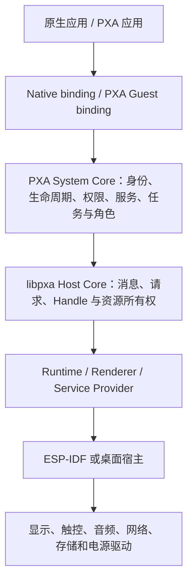

# PXA 技术白皮书

## 面向嵌入式产品的可移植应用平台

**版本：** 2026 年 9 月
**面向：** 智能硬件产品团队、生态合作伙伴与应用开发者

> **一句话概括：** PXA 在设备固件之上建立统一的应用身份、运行、服务和界面合约，让嵌入式产品能够独立交付应用、统一管理权限与资源，并在不同芯片和屏幕之间复用产品能力。

## 摘要

PXA 是面向智能硬件的可移植应用平台。它在设备系统之上建立统一的应用环境，让产品功能、互动内容与系统服务以独立应用的形式交付。应用通过签名 Package 安装和更新，Host 统一管理身份、授权、生命周期与资源，产品适配层连接屏幕、触控、音频、网络和存储。

PXA 的技术重点是**应用系统与产品硬件分层**。同一套应用模型连接原生应用与 WebAssembly 应用；一个 Package 可以提供可移植 Wasm 和匹配目标平台的 AOT Artifact；产品继续掌握显示、音频和电源等硬件体验。平台同时提供 Guest C SDK、打包与安装链路、桌面产品模拟器、ESP-IDF 产品工程和 PXADB 设备工具。Pai Touch 与 ESP32S31 Korvo-1 上的资源、音乐和游戏场景展示了这套链路的实际运行效果。

本文围绕架构、交付、安全、界面、资源管理、开发体验和设备案例，介绍 PXA 如何帮助智能硬件构建持续演进的应用生态。

## 核心亮点

| 能力 | 技术亮点 | 产品价值 |
| --- | --- | --- |
| 应用独立交付 | 签名 `.pxa` 包与固件分开构建；PXADB 安装、管理和调试应用 | 产品功能按应用迭代，固件与应用各自管理版本 |
| 可信运行 | 发布者签名、文件摘要、事务安装、权限作用域与私有数据隔离 | 为可扩展应用建立可审核的安装和运行边界 |
| 跨平台复用 | C99 可移植核心、运行时与服务 Provider、板级 port | 将通用应用机制从芯片、驱动和产品页面中分离 |
| 统一应用体验 | 原生与 PXA 应用共享身份、任务、导航、系统角色和主题模型 | 产品可组合自己的桌面、设置和状态界面 |
| 多种呈现方式 | 声明式 UI、Canvas、Surface 与 GameRender | 普通交互页面、媒体画面和游戏均可选择合适的绘制路径 |
| 有界资源 | 异步加载、共享预算、背压、引用所有权与退出清理 | 在内存和存储受限的设备上提供更可预测的行为 |
| 完整开发链路 | SDK、签名打包、产品模拟器、增量部署、PXADB CLI/GUI | 桌面验证、设备安装和现场诊断使用连续的工具流程 |

## 1. 产品定位与适用场景

PXA 面向希望在稳定固件基线之上持续增加应用能力的设备，例如触屏智能硬件、交互终端、带图形界面的控制器和轻量娱乐设备。适合独立交付的内容包括产品功能页、联网服务客户端、互动内容、小游戏、诊断工具与可选的系统角色。产品可以把硬件驱动、显示时序和电源策略继续留在固件中，同时让变化更频繁的应用逻辑走 Package 链路。

PXA 以三个概念组织应用：**App** 是签名、权限、安装和私有数据的管理单位；**Component** 是 App 内独立实例化的执行单元；**Artifact** 是 Component 的一种可执行形式，例如可移植 Wasm 或目标架构 AOT。产品因而可以分别管理包更新、组件生命周期、运行时选择和用户数据归属。

PXA 运行在 FreeRTOS、ESP-IDF 或桌面宿主提供的基础能力之上，向应用提供统一的服务合约。对于已有成熟 BSP 的产品，板级适配器可以沿用原有 DMA、framebuffer 和 codec 路径，同时接入 PXA 的应用控制面。

## 2. 系统架构：稳定合约与可替换实现分层

PXA System 负责应用注册、身份、生命周期、Intent、任务、系统角色、主题、事件和服务发现。`libpxa` 是平台无关的 C99 Host Core，处理控制消息、异步请求、资源 Handle、服务分发与所有权。WebAssembly 由 WAMR 适配层运行，LVGL 提供图形渲染，ESP-IDF 承接设备宿主。各层通过明确的接口协作，使通用应用能力可以跨产品复用。

**应用层**通过已协商的 Core 与服务能力工作。原生应用使用 Native binding，PXA Guest 通过受校验的消息跨越沙箱边界。两种 binding 共享身份、授权、取消、错误和生命周期语义。

**产品层**选择可信发布者、权限策略、系统角色、主题、服务 Provider、容量与板级参数。产品可以采用参考系统 UI，也可以将自己的 Home、Settings 和设备页面注册为系统角色，形成鲜明的品牌体验。

**板级层**持有硬件时序与大数据通道。board port 提供显示 Profile、输入和设备控制等接口；像素转换、DMA 提交、PCM 帧传输和物理 codec 由板级 component 负责。Pai Touch 的 PXA 直出帧沿用其显示热路径，兼顾统一应用模型与板级性能。

这一依赖方向让移植工作集中在对应层：新芯片接入平台与 board port，新 UI 后端接入 renderer，新设备能力由产品注册 Provider。应用身份和 Package 合约在这些变化中保持一致。

## 3. 应用交付：固件、应用和出厂预置分开管理

### 3.1 一个 Package 承载多种目标

`.pxa` 是单文件应用容器。Package 的签名清单描述发布者、App ID、版本、Component、Artifact、服务要求、权限与文件清单。一个 Component 可以同时携带可移植 Wasm 和多个目标架构 AOT 版本。激活时，Host 核对 Core 与服务要求，并按照目标、引擎、引擎 ABI、Wasm 特性和内存模型选择兼容的 Artifact，优先使用匹配的 AOT。

应用身份由已验证的发布者谱系与 App ID 确定。应用从 Wasm 切换到 AOT，或为另一块板增加 AOT Artifact，都沿用同一份私有数据、权限记录和系统地址。发布者密钥轮换由经过验证的谱系规则管理，保持应用身份的连续性。

### 3.2 从开发安装到产品更新

常规工作流是：开发者用 SDK 构建 Component，打包工具编译资源并生成签名 `.pxa`，PXADB 将容器送入设备的 Host 私有 inbox，设备在安装前完成签名、内容和兼容性验证，然后提交到受管理的 Package 目录。安装成功后，应用管理器可以列出、启动、停止、禁用、启用、卸载应用或显式清理数据。

ESP-IDF 固件构建与 PXA 应用打包是两条独立链路。产品可以分别安排固件发布、应用更新和出厂预置。日常应用更新通过 PXADB 完成；固件应用分区的刷写流程保留 PXA 数据分区中的已安装应用与私有数据。出厂阶段则可以显式生成包含预置应用的数据分区镜像。

### 3.3 中断后仍可判断的安装状态

安装器把当前版本、待安装版本和旧版本作为三个受管理的槽位，先完整复制与验证待安装内容，再完成持久化屏障和原子目录切换。一次更新只锁定对应 App 身份；中断后根据槽位状态恢复到可判定的已验证版本。代码目录与私有数据目录分开管理，卸载应用和清理数据由独立操作控制。

事务安装让可启动目录始终对应经过验证的 Package。POSIX 与 ESP LittleFS 适配分别提供安装过程所需的原子重命名、同步和持久化操作，支撑应用更新与恢复。

## 4. 安全与隔离：从包来源到服务使用

PXA 把可信运行贯穿安装、激活、服务调用和退出四个阶段。

1. **验证来源与内容。** 清单使用发布者 ECDSA P-256 签名，文件由签名清单中的 SHA-256 摘要约束。安装器检查文件清单、路径、大小和 Artifact 兼容性；产品配置可信发布者集合。
2. **检查应用能力。** Host 在激活前核对设备服务、服务版本与包内声明，让应用从符合要求的能力集合开始运行。
3. **按作用域授权。** 服务访问依次经过 Host 能力、签名清单声明、用户或产品策略授予，以及 Component 本地的权限 Handle。权限撤销同步更新相关 Handle 与在途请求的状态。
4. **隔离数据与资源。** 私有文件和键值存储与已验证应用身份绑定。Handle 检查类型、Component 归属和代际；Host 向服务注入可信的调用者身份。

Core v1 使用 64 位请求 token 和 64 位资源 Handle。控制消息带显式长度与版本，Host 在解码时检查边界；大块数据通过受控 Handle I/O 传输。异步请求在接受时预留终态通知容量，并通过成功、失败或取消交付一次结果。Guest 回调由 Host 串行调度，系统状态由 owner thread 修改，使调用顺序和资源归属清晰可追踪。

Package 验证、受管理的安装目录、发布者信任配置和服务授权共同构成产品侧的应用安全机制。产品团队可以据此制定应用发布、权限展示与私有数据管理策略。

## 5. 系统服务：统一入口连接设备能力

PXA 的服务以接口、版本、权限和 Provider 边界组织。应用提出“读取私有文件”“获取窗口指标”“播放声音”这样的请求，Host 将请求交给产品选定的实现。应用因此可以围绕稳定的服务语义开发，产品则持续优化设备驱动和硬件配置。

| 服务方向 | 应用能力 | 实现方式 |
| --- | --- | --- |
| Window、UI、Canvas、Surface | 窗口指标、安全区、系统导航、UI 事务与图形内容提交 | 桌面与 ESP 路径已接入；不同绘制方式按设备能力选择 |
| FS 与 Storage | 应用私有文件、目录和有界键值数据 | 按签名身份隔离；文件路径与配额由 Host 检查 |
| Permission | 检查、申请与撤销作用域权限 | 声明和授权分离；权限 Handle 不可跨 Component 转交 |
| Network | HTTP(S) 请求与响应流 | Host 管理 DNS、TLS、证书策略和网络传输 |
| Audio | PCM、合成音、短音效与流式 Ogg 音乐 | 混音和解码归 Host；物理输出由板级 codec 完成 |
| Assets | 文件索引、异步加载、预取、状态查询与资源 Handle | 缓存、引用和预算由 Host 统一管理 |
| IPC | 同一签名 App 内组件间的异步请求与回复 | Host Broker 路由 Component 间消息并保持调用者身份 |

例如，天气应用通过 Network 请求取得数据，通过 Storage 保存状态，再用 UI 呈现；产品可以为不同设备配置各自的网络 Provider。游戏则组合 GameRender、Clock、Assets 和 Audio：资源异步准备，渲染帧引用已就绪对象，后台时由生命周期事件协调计时与声音。服务组合让同一应用模型适应多种产品形态。

## 6. 界面体系：同一应用模型覆盖不同形态

### 6.1 显示 Profile 与系统导航

Display Profile 用逻辑分辨率、像素密度、刷新率、安全区、外形、圆角和裁切描述一块屏幕。应用从窗口与 UI 环境获得这些信息，将可交互控件放在安全区域内；圆屏可采用内接安全矩形，圆角屏还需根据按钮所在位置避开顶角。产品模拟器可以按板级 Profile 绘制遮罩并屏蔽遮罩外点击，方便在上板前发现布局问题。

PXA 将 Back、Home、最近任务和应用前后台切换放在统一任务与窗口合约中。应用先收到 Back 请求；未消费时系统执行默认返回动作。进入后台时，游戏应暂停模拟、输入按住状态与音效，并在恢复时重置计时基准。系统弹窗、状态栏或导航浮层需要覆盖应用时，显示路径可以临时进入合成模式，浮层结束并有新帧后再恢复直出。

### 6.2 系统角色与视觉主题

Home、Settings、状态栏、导航栏和权限提示属于可注册的系统角色，参考 LVGL UI 提供现成实现，产品可按策略替换或裁剪。原生应用与 PXA 应用共用 App registry 和任务模型，形成统一的桌面目录与导航体验。

主题以语义色和字体角色表达“背景、表面、主色、正文、警告”等用途。明暗模式、产品配色或 locale 变化后，Host 发布带 generation 的新环境；使用主题 token 的普通 UI 由渲染器更新，自绘 Canvas 内容由应用按需重绘。字体角色涵盖标题、正文、标签等层级，产品可选择覆盖目标语言的实际字体和字形子集。应用名称、描述和文案使用 locale 资源与回退规则，同时保持稳定的应用身份和权限。

### 6.3 四种内容呈现路径

- **声明式 UI：**适合表单、设置、列表和控制页面。应用提交有边界的 UI transaction，Host 验证并在 UI owner thread 应用；结构、图片源、网格、MOVE 与常用属性共用事务提交机制。
- **Canvas：**适合轻量自绘、仪表和二维图形。应用提交绘制指令，输入仍使用统一的逻辑坐标与窗口关系。
- **Surface：**适合自行生成像素帧的媒体或游戏。板级路径决定映射缓冲、显示提交和 DMA 细节。
- **GameRender：**适合纹理、调色板、DrawList 和软件光栅场景。应用可选择渲染分辨率和缓冲策略，Host 对 DrawList 与资源引用做边界检查。

这些路径共享应用身份和生命周期，同时让高频游戏帧走适合自身的图形通道。平台提供 headless 与 LVGL renderer，支持自动化场景和产品界面呈现。

## 7. 资源与音频：在有限内存中维持可预测性

### 7.1 资源先准备，使用时只传受控引用

打包阶段可以把纹理、调色板、图片与其他文件编译为带索引的资源。运行时的 Assets 服务通过固定数量的 worker 执行有界读取和解码；纹理数据可直接进入最终对象，减少整文件临时副本。应用获得带类型和所有权的资源 Handle，再交给 GameRender、UI、Canvas 或音频服务使用。应用可以在场景切换前准备资源，让绘制与播放阶段聚焦于已经就绪的内容。

资源 Handle、缓存条目、已提交帧的引用和音频播放实例各自拥有清晰的持有关系。已提交的帧持续持有绘制所需纹理；已接受的短音效持续持有播放所需数据。所有消费者释放后，缓存即可淘汰对象。应用还能预取下一场景，并在正式进入场景时取得有效资源 Handle。

### 7.2 预算与调度

资源预算按应用、全局及内外部 RAM 类别记录已分配字节和分配预留，实际释放完成后返还额度。新旧资源短暂重叠、在途帧引用和扩容中的两块缓冲都计入峰值。队列、请求表和容量均有明确上限，应用可以根据背压信号调整加载节奏或显示加载状态。

ESP 产品 Host 将文件缓存、图像与音频对象、临时空间及选定 codec 分配入口纳入共享预算。文件 worker 复用固定任务，音频补充请求在共享存储竞争时优先于后台预取。资源峰值、缓存淘汰和任务队列均有可观测指标，便于产品按设备内存配置调优。

### 7.3 音频能力与实时边界

当前音频接口支持 16 kHz 单声道有符号 16 位 PCM、合成音、预加载短 PCM 音效，以及 Ogg Vorbis/Opus 音乐的流式解码。当前 Host 配置最多混合 3 个媒体会话；资源总线支持一条背景音乐与最多 6 个同时播放的短音效。每次 PCM 写入和会话 FIFO 都有上限，队列满时返回 `WOULD_BLOCK`，由应用决定下一次何时重试。

解码、重采样、混音与物理输出由 Host 和板级接口分层承担。音乐使用固定大小的 PCM ring 与预缓冲阈值，播放实例通过 READY、ENDED、STOPPED 和 ERROR 等事件表达状态。后台和锁屏时 Host 协调会话暂停，退出时先停止音频消费者再释放包资源，让音频与应用生命周期保持一致。

## 8. 开发工具与板级迁移

PXA 的工作流从应用源码持续到真实设备。Guest C SDK 提供有界请求构造、结果解析与资源 Handle 操作；Native C binding 让原生模块进入同一系统模型。打包工具生成签名包并在构建时检查服务声明与 Wasm 导入。桌面产品模拟器加载签名 Package，运行窗口、输入、UI、权限、时钟和其他已接入服务；无界面模拟器及规范 golden vectors 支持自动化测试。

`tools/dev.sh` 把应用增量打包、PXADB 覆盖安装和启动串为开发循环。模拟器模式重新启动 Guest 并输出运行日志；设备模式直接在现有固件上部署应用。PXADB CLI/GUI 可以发现设备、查看日志和截图、注入触摸或按键、传输文件，并管理 Package。保存、打包、部署和重启应用由同一工具流程串联。

板级工程以 `PXA_BOARD` 选择板子，每块板有独立的驱动 component、配置叠加、分区表与托管依赖锁。Pai Touch 提供新 BSP 的 board port 示例；既有固件可在显示初始化后用 adapter 注册相同合约。当前工程包含 Pai Touch、Sensecap Watcher 和 ESP32S31 Korvo-1 三种板级配置，覆盖 ESP32-S3 Xtensa 与 ESP32-S31 RISC-V 的构建路径。桌面模拟器与板级 Profile 配合，帮助开发者先检查显示形态和交互，再把应用部署到真实设备。

## 9. 从桌面到设备：真实场景展示

PXA 的产品模拟器运行签名 Package，覆盖窗口、触控、主题、权限、资源、音频和游戏画面。规范向量、Core/WAMR、ESP Host 与 LVGL 回归把消息处理、资源所有权和应用生命周期纳入自动化检查。板级工程已经构建 Pai Touch、ESP32S31 Korvo-1 和 Sensecap Watcher 三种固件配置。

在 Pai Touch 与 ESP32S31 Korvo-1 上，资源场景分别完成三轮运行。每轮包含 8193 B 文件读取与 EOF、100 次场景切换、20 张文件纹理、4 张可见纹理、100 次准备后音效触发、音乐 READY/STOPPED 通知，以及应用退出检查。两台设备的运行日志均记录音乐 `underruns=0`、`missing=0`。这些场景展示了文件资源、缓存、音频和生命周期在真实硬件上的协同工作。

**Pai Touch：**`voxel-craft` 在 296×240 屏幕进入三维地形游戏，完成菜单、触摸转向、后台切换、恢复和退出。PXA 应用、GameRender、文件资源、触摸输入与音乐共同构成完整的交互过程。

**ESP32S31 Korvo-1：**`plane-shooter` 在设备上显示文件图片菜单并进入战斗，随后完成后台切换和画面恢复。应用通过 Canvas 图片、资源 Handle、系统生命周期和板级显示路径呈现游戏体验。

两个案例分别运行在 ESP32-S3 Xtensa 与 ESP32-S31 RISC-V 架构上，体现了 PXA 在应用模型、资源服务和产品适配上的复用方式。

## 结语

PXA 把智能硬件组织成一个有身份、有权限、可独立交付应用的产品平台。签名 Package 与事务安装支撑功能迭代，可移植核心与板级 port 支撑跨产品复用，统一 UI 与服务模型连接用户体验，资源预算与生命周期规则贴合嵌入式设备的实际约束。从桌面模拟器到真实设备，PXA 为产品团队和应用开发者提供了一条连贯的创造与交付路径。
